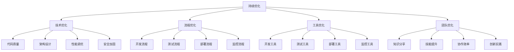

# 持续优化机制

## 🎯 优化目标

### 核心目标
- **性能优化**: 系统响应时间、吞吐量、资源利用率持续改进
- **质量提升**: 代码质量、测试覆盖率、缺陷率持续优化
- **效率提升**: 开发效率、部署频率、故障恢复时间持续改进
- **用户体验**: 功能易用性、响应速度、稳定性持续优化

### 优化维度


## 📊 监控指标体系

### 技术指标监控
```yaml
# 代码质量指标
code_quality_metrics:
  test_coverage:
    target: ">90%"
    current: "85%"
    trend: "increasing"
  
  code_complexity:
    target: "<10"
    current: "12"
    trend: "decreasing"
  
  duplication_rate:
    target: "<5%"
    current: "8%"
    trend: "stable"
  
  technical_debt:
    target: "Low"
    current: "Medium"
    trend: "improving"

# 性能指标
performance_metrics:
  response_time:
    target: "<100ms"
    current: "150ms"
    trend: "improving"
  
  throughput:
    target: ">1000 req/s"
    current: "800 req/s"
    trend: "increasing"
  
  error_rate:
    target: "<1%"
    current: "0.5%"
    trend: "stable"
  
  availability:
    target: ">99.9%"
    current: "99.5%"
    trend: "improving"

# 业务指标
business_metrics:
  collection_success_rate:
    target: ">95%"
    current: "92%"
    trend: "improving"
  
  processing_latency:
    target: "<1s"
    current: "1.5s"
    trend: "improving"
  
  user_satisfaction:
    target: ">90%"
    current: "85%"
    trend: "increasing"
```

### 流程效率指标
```yaml
# 开发效率指标
development_efficiency:
  task_completion_time:
    target: "<2 days"
    current: "3 days"
    trend: "improving"
  
  code_review_time:
    target: "<4 hours"
    current: "6 hours"
    trend: "stable"
  
  deployment_frequency:
    target: "Daily"
    current: "Every 2 days"
    trend: "improving"
  
  lead_time:
    target: "<1 day"
    current: "2 days"
    trend: "improving"

# 团队协作指标
team_collaboration:
  knowledge_sharing_frequency:
    target: "Weekly"
    current: "Bi-weekly"
    trend: "improving"
  
  onboarding_time:
    target: "<3 days"
    current: "5 days"
    trend: "improving"
  
  cross_team_communication:
    target: "High"
    current: "Medium"
    trend: "improving"
```

## 🔍 定期评估机制

### 评估周期
```yaml
# 评估频率
evaluation_schedule:
  daily:
    - "性能指标监控"
    - "错误日志分析"
    - "用户反馈收集"
  
  weekly:
    - "代码质量检查"
    - "测试覆盖率统计"
    - "部署成功率分析"
  
  monthly:
    - "架构设计回顾"
    - "技术债务评估"
    - "工具效率分析"
  
  quarterly:
    - "团队技能评估"
    - "流程优化建议"
    - "技术栈更新评估"
```

### 评估方法
```python
# 评估框架
class OptimizationEvaluator:
    """优化评估器"""
    
    def __init__(self):
        self.metrics_collector = MetricsCollector()
        self.trend_analyzer = TrendAnalyzer()
        self.recommendation_engine = RecommendationEngine()
    
    async def evaluate_performance(self) -> Dict[str, Any]:
        """评估性能指标"""
        current_metrics = await self.metrics_collector.get_current_metrics()
        historical_metrics = await self.metrics_collector.get_historical_metrics()
        trends = self.trend_analyzer.analyze_trends(historical_metrics)
        
        return {
            "current": current_metrics,
            "trends": trends,
            "recommendations": self.recommendation_engine.generate_recommendations(current_metrics, trends)
        }
    
    async def evaluate_quality(self) -> Dict[str, Any]:
        """评估质量指标"""
        code_quality = await self.analyze_code_quality()
        test_coverage = await self.analyze_test_coverage()
        security_scan = await self.analyze_security_issues()
        
        return {
            "code_quality": code_quality,
            "test_coverage": test_coverage,
            "security": security_scan
        }
    
    async def evaluate_efficiency(self) -> Dict[str, Any]:
        """评估效率指标"""
        development_efficiency = await self.analyze_development_efficiency()
        deployment_efficiency = await self.analyze_deployment_efficiency()
        team_collaboration = await self.analyze_team_collaboration()
        
        return {
            "development": development_efficiency,
            "deployment": deployment_efficiency,
            "collaboration": team_collaboration
        }
```

## 🚀 优化实施流程

### 问题识别阶段
```python
# 问题识别框架
class ProblemIdentifier:
    """问题识别器"""
    
    async def identify_performance_issues(self) -> List[PerformanceIssue]:
        """识别性能问题"""
        issues = []
        
        # 响应时间分析
        if await self.check_response_time_threshold():
            issues.append(PerformanceIssue(
                type="response_time",
                severity="high",
                description="响应时间超过阈值",
                recommendation="优化数据库查询和缓存策略"
            ))
        
        # 内存使用分析
        if await self.check_memory_usage():
            issues.append(PerformanceIssue(
                type="memory_usage",
                severity="medium",
                description="内存使用率过高",
                recommendation="优化内存管理和垃圾回收"
            ))
        
        return issues
    
    async def identify_quality_issues(self) -> List[QualityIssue]:
        """识别质量问题"""
        issues = []
        
        # 测试覆盖率检查
        coverage = await self.get_test_coverage()
        if coverage < 90:
            issues.append(QualityIssue(
                type="test_coverage",
                severity="high",
                description=f"测试覆盖率不足: {coverage}%",
                recommendation="增加单元测试和集成测试"
            ))
        
        # 代码复杂度检查
        complexity = await self.get_code_complexity()
        if complexity > 10:
            issues.append(QualityIssue(
                type="code_complexity",
                severity="medium",
                description=f"代码复杂度过高: {complexity}",
                recommendation="重构复杂函数和类"
            ))
        
        return issues
```

### 方案设计阶段
```python
# 优化方案设计
class OptimizationPlanner:
    """优化方案规划器"""
    
    def __init__(self):
        self.impact_analyzer = ImpactAnalyzer()
        self.resource_estimator = ResourceEstimator()
        self.risk_assessor = RiskAssessor()
    
    async def design_optimization_plan(self, issues: List[Issue]) -> OptimizationPlan:
        """设计优化方案"""
        plan = OptimizationPlan()
        
        for issue in issues:
            # 分析影响范围
            impact = await self.impact_analyzer.analyze_impact(issue)
            
            # 评估资源需求
            resources = await self.resource_estimator.estimate_resources(issue)
            
            # 评估实施风险
            risks = await self.risk_assessor.assess_risks(issue)
            
            # 生成优化建议
            recommendation = OptimizationRecommendation(
                issue=issue,
                impact=impact,
                resources=resources,
                risks=risks,
                priority=self.calculate_priority(impact, resources, risks)
            )
            
            plan.add_recommendation(recommendation)
        
        # 排序和优化
        plan.sort_by_priority()
        plan.optimize_sequence()
        
        return plan
    
    def calculate_priority(self, impact: Impact, resources: Resources, risks: Risks) -> int:
        """计算优先级"""
        # 优先级计算公式：影响/资源/风险
        priority_score = (impact.score / resources.effort) / (risks.score + 1)
        return min(max(int(priority_score * 100), 1), 100)
```

### 实施验证阶段
```python
# 优化实施验证
class OptimizationValidator:
    """优化实施验证器"""
    
    async def validate_optimization(self, optimization: Optimization) -> ValidationResult:
        """验证优化效果"""
        result = ValidationResult()
        
        # 性能验证
        performance_result = await self.validate_performance(optimization)
        result.add_validation("performance", performance_result)
        
        # 质量验证
        quality_result = await self.validate_quality(optimization)
        result.add_validation("quality", quality_result)
        
        # 稳定性验证
        stability_result = await self.validate_stability(optimization)
        result.add_validation("stability", stability_result)
        
        # 综合评估
        result.overall_success = all([
            performance_result.success,
            quality_result.success,
            stability_result.success
        ])
        
        return result
    
    async def validate_performance(self, optimization: Optimization) -> PerformanceValidation:
        """性能验证"""
        # 执行性能测试
        before_metrics = optimization.baseline_metrics
        after_metrics = await self.run_performance_tests()
        
        # 计算改进幅度
        improvement = self.calculate_improvement(before_metrics, after_metrics)
        
        return PerformanceValidation(
            success=improvement.overall > 0,
            improvement=improvement,
            metrics=after_metrics
        )
```

## 📈 反馈循环机制

### 反馈收集
```python
# 反馈收集系统
class FeedbackCollector:
    """反馈收集器"""
    
    def __init__(self):
        self.user_feedback = UserFeedbackCollector()
        self.system_metrics = SystemMetricsCollector()
        self.team_feedback = TeamFeedbackCollector()
    
    async def collect_feedback(self) -> FeedbackData:
        """收集反馈数据"""
        feedback_data = FeedbackData()
        
        # 用户反馈
        user_feedback = await self.user_feedback.collect()
        feedback_data.add_user_feedback(user_feedback)
        
        # 系统指标
        system_metrics = await self.system_metrics.collect()
        feedback_data.add_system_metrics(system_metrics)
        
        # 团队反馈
        team_feedback = await self.team_feedback.collect()
        feedback_data.add_team_feedback(team_feedback)
        
        return feedback_data
    
    async def analyze_feedback_trends(self, feedback_data: FeedbackData) -> FeedbackAnalysis:
        """分析反馈趋势"""
        analysis = FeedbackAnalysis()
        
        # 趋势分析
        trends = await self.analyze_trends(feedback_data)
        analysis.trends = trends
        
        # 问题识别
        issues = await self.identify_issues(feedback_data)
        analysis.issues = issues
        
        # 改进建议
        recommendations = await self.generate_recommendations(feedback_data)
        analysis.recommendations = recommendations
        
        return analysis
```

### 改进实施
```python
# 改进实施管理
class ImprovementManager:
    """改进管理器"""
    
    def __init__(self):
        self.improvement_tracker = ImprovementTracker()
        self.resource_manager = ResourceManager()
        self.communication_manager = CommunicationManager()
    
    async def implement_improvement(self, improvement: Improvement) -> ImplementationResult:
        """实施改进"""
        result = ImplementationResult()
        
        try:
            # 资源分配
            resources = await self.resource_manager.allocate_resources(improvement)
            
            # 实施改进
            implementation = await self.execute_improvement(improvement, resources)
            result.implementation = implementation
            
            # 效果验证
            validation = await self.validate_improvement(improvement)
            result.validation = validation
            
            # 经验总结
            lessons_learned = await self.extract_lessons_learned(improvement)
            result.lessons_learned = lessons_learned
            
            result.success = validation.success
            
        except Exception as e:
            result.success = False
            result.error = str(e)
            result.lessons_learned = [f"实施失败: {e}"]
        
        # 更新跟踪记录
        await self.improvement_tracker.update_tracking(improvement, result)
        
        return result
```

## 🎯 优化成功标准

### 技术指标标准
```yaml
# 性能优化目标
performance_targets:
  response_time_improvement: ">20%"
  throughput_improvement: ">30%"
  error_rate_reduction: ">50%"
  availability_improvement: ">5%"

# 质量优化目标
quality_targets:
  test_coverage_increase: ">10%"
  code_complexity_reduction: ">15%"
  technical_debt_reduction: ">25%"
  security_issue_reduction: ">80%"

# 效率优化目标
efficiency_targets:
  development_time_reduction: ">20%"
  deployment_frequency_increase: ">50%"
  lead_time_reduction: ">30%"
  recovery_time_reduction: ">60%"
```

### 团队协作标准
```yaml
# 协作效率目标
collaboration_targets:
  knowledge_sharing_increase: ">40%"
  onboarding_time_reduction: ">50%"
  cross_team_communication_improvement: ">60%"
  code_review_efficiency_increase: ">25%"

# 创新实践目标
innovation_targets:
  new_tool_adoption: ">80%"
  best_practice_implementation: ">90%"
  process_optimization_frequency: "Monthly"
  technology_upgrade_frequency: "Quarterly"
```

## 📊 优化效果跟踪

### 跟踪仪表板
```python
# 优化效果跟踪
class OptimizationDashboard:
    """优化效果仪表板"""
    
    def __init__(self):
        self.metrics_display = MetricsDisplay()
        self.trend_visualization = TrendVisualization()
        self.alert_system = AlertSystem()
    
    async def generate_dashboard(self) -> DashboardData:
        """生成仪表板数据"""
        dashboard = DashboardData()
        
        # 关键指标
        key_metrics = await self.get_key_metrics()
        dashboard.key_metrics = key_metrics
        
        # 趋势图表
        trends = await self.generate_trend_charts()
        dashboard.trends = trends
        
        # 改进进度
        progress = await self.track_improvement_progress()
        dashboard.progress = progress
        
        # 告警信息
        alerts = await self.check_alerts()
        dashboard.alerts = alerts
        
        return dashboard
    
    async def send_optimization_report(self, dashboard: DashboardData):
        """发送优化报告"""
        report = OptimizationReport(
            dashboard=dashboard,
            recommendations=await self.generate_recommendations(),
            next_steps=await self.plan_next_steps()
        )
        
        await self.notify_stakeholders(report)
```

---

**维护者**: AI全栈工程师团队  
**最后更新**: 2024-09-21  
**版本**: v1.0.0
