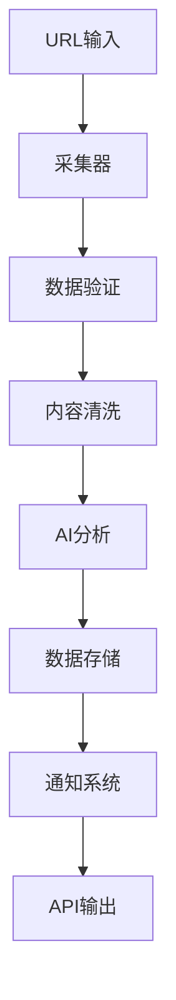

# 开发指南

## 🚀 快速开始

### 环境准备
```bash
# 1. 克隆项目
git clone <repository-url>
cd Firecrawl数据采集器

# 2. 创建虚拟环境
python -m venv venv
source venv/bin/activate  # Linux/Mac
# 或 venv\Scripts\activate  # Windows

# 3. 安装依赖
pip install -r requirements.txt

# 4. 配置环境变量
cp .env.example .env
# 编辑.env文件，填入必要的配置

# 5. 初始化数据库
python scripts/init-db.py

# 6. 运行测试
pytest tests/

# 7. 启动开发服务器
python -m uvicorn src.api_server:app --reload
```

### 开发环境配置
```bash
# 使用Docker Compose启动开发环境
docker-compose -f config/deployment/docker-compose.yml up -d

# 查看服务状态
docker-compose ps

# 查看日志
docker-compose logs -f app
```

## 🏗️ 项目架构

### 核心模块
```
src/
├── collectors/          # 数据采集模块
│   ├── firecrawl_collector.py
│   ├── base_collector.py
│   └── custom_collectors/
├── processors/          # 数据处理模块
│   ├── data_processor.py
│   ├── content_cleaner.py
│   └── ai_processor.py
├── models/             # 数据模型
│   ├── database_models.py
│   ├── api_models.py
│   └── domain_models.py
├── api/                # API接口
│   ├── api_server.py
│   ├── routes/
│   └── middleware/
├── services/           # 业务服务
│   ├── collection_service.py
│   ├── processing_service.py
│   └── notification_service.py
├── utils/              # 工具函数
│   ├── logging_utils.py
│   ├── validation_utils.py
│   └── crypto_utils.py
└── config/             # 配置管理
    ├── settings.py
    ├── database.py
    └── redis.py
```

### 数据流架构


## 🔧 开发规范

### 代码结构规范
```python
# 文件头部注释
"""
模块名称: firecrawl_collector.py
描述: Firecrawl数据采集器核心模块
作者: AI全栈工程师
创建时间: 2024-09-21
版本: v1.0.0
"""

# 导入顺序
import os
import sys
from typing import Dict, List, Optional, Any
from datetime import datetime
import logging

import requests
import pandas as pd
from fastapi import FastAPI, HTTPException
from sqlalchemy import create_engine

from src.config.settings import Settings
from src.utils.logging_utils import get_logger

# 常量定义
DEFAULT_TIMEOUT = 30
MAX_RETRIES = 3
SUPPORTED_FORMATS = ['json', 'xml', 'html']

# 日志配置
logger = get_logger(__name__)

# 类定义
class FirecrawlCollector:
    """Firecrawl数据采集器"""
    
    def __init__(self, config: Dict[str, Any]):
        """初始化采集器
        
        Args:
            config: 配置字典
        """
        self.config = config
        self.session = requests.Session()
        logger.info("FirecrawlCollector initialized")

# 函数定义
async def collect_data(url: str, options: Dict[str, Any]) -> Dict[str, Any]:
    """采集数据
    
    Args:
        url: 目标URL
        options: 采集选项
        
    Returns:
        Dict[str, Any]: 采集结果
        
    Raises:
        ValueError: URL格式错误
        requests.RequestException: 网络请求失败
    """
    # 实现逻辑
    pass

# 主程序入口
if __name__ == "__main__":
    # 主程序逻辑
    pass
```

### API开发规范
```python
from fastapi import FastAPI, HTTPException, Depends
from pydantic import BaseModel, Field
from typing import List, Optional
import logging

app = FastAPI(title="Firecrawl数据采集器API", version="1.0.0")

class CollectRequest(BaseModel):
    """采集请求模型"""
    url: str = Field(..., description="目标URL", example="https://example.com")
    options: Optional[Dict[str, Any]] = Field(default={}, description="采集选项")
    
    class Config:
        schema_extra = {
            "example": {
                "url": "https://example.com",
                "options": {
                    "format": "json",
                    "timeout": 30
                }
            }
        }

class CollectResponse(BaseModel):
    """采集响应模型"""
    success: bool = Field(..., description="是否成功")
    data: Optional[Dict[str, Any]] = Field(None, description="采集数据")
    error: Optional[str] = Field(None, description="错误信息")
    timestamp: datetime = Field(default_factory=datetime.utcnow, description="时间戳")

@app.post("/api/v1/collect", response_model=CollectResponse)
async def collect_endpoint(
    request: CollectRequest,
    collector: FirecrawlCollector = Depends(get_collector)
) -> CollectResponse:
    """数据采集端点
    
    Args:
        request: 采集请求
        collector: 采集器实例
        
    Returns:
        CollectResponse: 采集结果
    """
    try:
        logger.info(f"Collecting data from {request.url}")
        
        result = await collector.collect(request.url, request.options)
        
        return CollectResponse(
            success=True,
            data=result,
            timestamp=datetime.utcnow()
        )
        
    except ValueError as e:
        logger.error(f"Invalid request: {e}")
        raise HTTPException(status_code=400, detail=str(e))
        
    except Exception as e:
        logger.error(f"Collection failed: {e}")
        raise HTTPException(status_code=500, detail="Internal server error")
```

### 数据库操作规范
```python
from sqlalchemy import Column, Integer, String, DateTime, Text, Boolean
from sqlalchemy.ext.declarative import declarative_base
from sqlalchemy.orm import sessionmaker
from sqlalchemy import create_engine
from datetime import datetime

Base = declarative_base()

class CollectionRecord(Base):
    """采集记录模型"""
    __tablename__ = "collection_records"
    
    id = Column(Integer, primary_key=True, index=True)
    url = Column(String(500), nullable=False, index=True)
    status = Column(String(50), nullable=False, default="pending")
    content = Column(Text, nullable=True)
    metadata = Column(Text, nullable=True)  # JSON字符串
    created_at = Column(DateTime, default=datetime.utcnow)
    updated_at = Column(DateTime, default=datetime.utcnow, onupdate=datetime.utcnow)
    is_active = Column(Boolean, default=True)

class DatabaseService:
    """数据库服务类"""
    
    def __init__(self, database_url: str):
        self.engine = create_engine(database_url)
        self.SessionLocal = sessionmaker(autocommit=False, autoflush=False, bind=self.engine)
        Base.metadata.create_all(bind=self.engine)
    
    def get_session(self):
        """获取数据库会话"""
        return self.SessionLocal()
    
    async def create_record(self, url: str, content: str, metadata: Dict[str, Any]) -> CollectionRecord:
        """创建采集记录"""
        with self.get_session() as session:
            record = CollectionRecord(
                url=url,
                content=content,
                metadata=json.dumps(metadata),
                status="completed"
            )
            session.add(record)
            session.commit()
            session.refresh(record)
            return record
    
    async def get_records(self, limit: int = 100, offset: int = 0) -> List[CollectionRecord]:
        """获取采集记录"""
        with self.get_session() as session:
            return session.query(CollectionRecord)\
                         .filter(CollectionRecord.is_active == True)\
                         .offset(offset)\
                         .limit(limit)\
                         .all()
```

## 🧪 测试开发

### 单元测试规范
```python
import pytest
from unittest.mock import Mock, patch, AsyncMock
from datetime import datetime
from src.collectors.firecrawl_collector import FirecrawlCollector
from src.models.database_models import CollectionRecord

class TestFirecrawlCollector:
    """FirecrawlCollector测试类"""
    
    @pytest.fixture
    def collector(self):
        """采集器测试夹具"""
        config = {
            "api_key": "test_api_key",
            "base_url": "https://api.firecrawl.dev",
            "timeout": 30
        }
        return FirecrawlCollector(config)
    
    @pytest.fixture
    def sample_url(self):
        """示例URL"""
        return "https://example.com"
    
    @pytest.fixture
    def sample_response(self):
        """示例响应数据"""
        return {
            "success": True,
            "data": {
                "url": "https://example.com",
                "title": "Example Domain",
                "content": "This domain is for use in illustrative examples",
                "metadata": {
                    "status_code": 200,
                    "content_type": "text/html"
                }
            }
        }
    
    @pytest.mark.asyncio
    async def test_collect_success(self, collector, sample_url, sample_response):
        """测试成功采集数据"""
        with patch('requests.Session.get') as mock_get:
            mock_get.return_value.json.return_value = sample_response
            mock_get.return_value.status_code = 200
            
            result = await collector.collect(sample_url)
            
            assert result["success"] is True
            assert result["data"]["url"] == sample_url
            assert "content" in result["data"]
    
    @pytest.mark.asyncio
    async def test_collect_invalid_url(self, collector):
        """测试无效URL处理"""
        with pytest.raises(ValueError, match="Invalid URL format"):
            await collector.collect("invalid-url")
    
    @pytest.mark.asyncio
    async def test_collect_network_error(self, collector, sample_url):
        """测试网络错误处理"""
        with patch('requests.Session.get') as mock_get:
            mock_get.side_effect = requests.RequestException("Network error")
            
            with pytest.raises(requests.RequestException):
                await collector.collect(sample_url)
    
    def test_config_validation(self):
        """测试配置验证"""
        # 测试有效配置
        valid_config = {
            "api_key": "valid_key",
            "base_url": "https://api.firecrawl.dev"
        }
        collector = FirecrawlCollector(valid_config)
        assert collector.config["api_key"] == "valid_key"
        
        # 测试无效配置
        with pytest.raises(ValueError):
            FirecrawlCollector({})

class TestDatabaseService:
    """数据库服务测试类"""
    
    @pytest.fixture
    def db_service(self):
        """数据库服务测试夹具"""
        return DatabaseService("sqlite:///:memory:")
    
    @pytest.mark.asyncio
    async def test_create_record(self, db_service):
        """测试创建记录"""
        url = "https://example.com"
        content = "Test content"
        metadata = {"test": "data"}
        
        record = await db_service.create_record(url, content, metadata)
        
        assert record.url == url
        assert record.content == content
        assert record.status == "completed"
        assert record.id is not None
```

### 集成测试规范
```python
import pytest
import httpx
from fastapi.testclient import TestClient
from src.api.api_server import app

class TestAPI:
    """API集成测试类"""
    
    @pytest.fixture
    def client(self):
        """测试客户端"""
        return TestClient(app)
    
    def test_health_check(self, client):
        """测试健康检查端点"""
        response = client.get("/health")
        assert response.status_code == 200
        assert response.json()["status"] == "healthy"
    
    def test_collect_endpoint(self, client):
        """测试采集端点"""
        payload = {
            "url": "https://example.com",
            "options": {
                "format": "json",
                "timeout": 30
            }
        }
        
        with patch('src.collectors.firecrawl_collector.FirecrawlCollector.collect') as mock_collect:
            mock_collect.return_value = {
                "success": True,
                "data": {"content": "test content"}
            }
            
            response = client.post("/api/v1/collect", json=payload)
            
            assert response.status_code == 200
            assert response.json()["success"] is True
    
    def test_collect_endpoint_invalid_url(self, client):
        """测试无效URL端点"""
        payload = {
            "url": "invalid-url",
            "options": {}
        }
        
        response = client.post("/api/v1/collect", json=payload)
        
        assert response.status_code == 400
        assert "Invalid URL" in response.json()["detail"]
```

## 🔍 调试技巧

### 日志配置
```python
import logging
import sys
from datetime import datetime

# 配置日志格式
LOG_FORMAT = "%(asctime)s - %(name)s - %(levelname)s - %(message)s"
DATE_FORMAT = "%Y-%m-%d %H:%M:%S"

# 配置根日志器
logging.basicConfig(
    level=logging.INFO,
    format=LOG_FORMAT,
    datefmt=DATE_FORMAT,
    handlers=[
        logging.StreamHandler(sys.stdout),
        logging.FileHandler("logs/app.log", encoding="utf-8")
    ]
)

# 创建模块日志器
logger = logging.getLogger(__name__)

# 使用示例
logger.info("Application started")
logger.debug("Debug information")
logger.warning("Warning message")
logger.error("Error occurred", exc_info=True)
```

### 性能分析
```python
import time
import functools
import cProfile
import pstats
from memory_profiler import profile

def timing_decorator(func):
    """计时装饰器"""
    @functools.wraps(func)
    async def wrapper(*args, **kwargs):
        start_time = time.time()
        result = await func(*args, **kwargs)
        end_time = time.time()
        logger.info(f"{func.__name__} took {end_time - start_time:.2f} seconds")
        return result
    return wrapper

@profile
def memory_intensive_function():
    """内存密集型函数"""
    data = []
    for i in range(100000):
        data.append(f"item_{i}")
    return data

def profile_function(func):
    """性能分析装饰器"""
    @functools.wraps(func)
    def wrapper(*args, **kwargs):
        profiler = cProfile.Profile()
        profiler.enable()
        
        result = func(*args, **kwargs)
        
        profiler.disable()
        stats = pstats.Stats(profiler)
        stats.sort_stats('cumulative')
        stats.print_stats(10)
        
        return result
    return wrapper
```

## 📚 常用工具

### 代码质量工具
```bash
# 代码格式化
black src/ tests/
isort src/ tests/

# 代码检查
flake8 src/ tests/
mypy src/
pylint src/

# 安全检查
bandit -r src/
safety check

# 复杂度分析
radon cc src/ -a
xenon src/ --max-absolute B --max-modules A --max-average A
```

### 测试工具
```bash
# 运行测试
pytest tests/ -v --cov=src --cov-report=html

# 运行特定测试
pytest tests/test_collector.py::TestFirecrawlCollector::test_collect_success -v

# 生成覆盖率报告
pytest --cov=src --cov-report=term-missing

# 性能测试
pytest tests/performance/ -v --benchmark-only
```

### 部署工具
```bash
# Docker构建
docker build -t firecrawl-collector:latest .

# Docker Compose部署
docker-compose -f config/deployment/docker-compose.yml up -d

# 健康检查
curl http://localhost:8000/health

# 日志查看
docker-compose logs -f app
```

---

**文档版本**: v1.0.0  
**最后更新**: 2024-09-21  
**维护者**: AI全栈工程师
