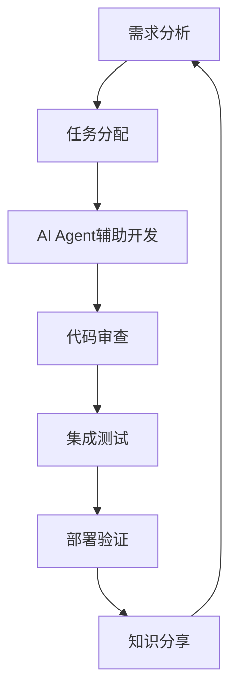

# 团队协作规范

## 👥 团队协作原则

### 统一AI Agent配置
所有团队成员使用相同的AI Agent配置，确保：
- **代码风格一致**: 统一的命名规范、格式化和文档标准
- **开发流程统一**: 标准化的任务拆分、实施和验证流程
- **质量保证一致**: 统一的测试覆盖率和代码质量标准
- **知识共享**: 统一的代码模板和最佳实践库

### 协作工作流


## 🔄 持续集成流程

### 开发阶段
1. **需求理解**
   - 使用AI Agent分析需求
   - 生成技术方案和架构设计
   - 创建任务拆分和实施计划

2. **代码开发**
   - 使用统一的代码模板
   - 遵循项目规范和最佳实践
   - 实时质量检查和优化建议

3. **测试验证**
   - 自动生成测试用例
   - 执行单元测试和集成测试
   - 性能和安全检查

### 审查阶段
1. **代码审查**
   - AI Agent辅助代码审查
   - 自动化质量检查
   - 性能和安全评估

2. **文档更新**
   - 自动生成API文档
   - 更新技术文档
   - 维护变更日志

### 部署阶段
1. **环境验证**
   - 自动化部署测试
   - 环境配置验证
   - 健康检查确认

2. **监控告警**
   - 性能指标监控
   - 错误日志分析
   - 用户反馈收集

## 📊 团队质量标准

### 代码质量指标
```yaml
# 团队代码质量标准
code_quality:
  test_coverage: ">90%"
  code_complexity: "<10"
  duplication_rate: "<5%"
  technical_debt: "Low"
  documentation_coverage: ">80%"

# 性能标准
performance:
  response_time: "<100ms"
  throughput: ">1000 req/s"
  error_rate: "<1%"
  availability: ">99.9%"

# 安全标准
security:
  vulnerability_scan: "Pass"
  dependency_check: "Up to date"
  access_control: "Implemented"
  data_encryption: "Enabled"
```

### 团队协作指标
```yaml
# 协作效率指标
collaboration:
  task_completion_time: "<2 days"
  code_review_time: "<4 hours"
  deployment_frequency: "Daily"
  lead_time: "<1 day"
  mean_time_to_recovery: "<1 hour"

# 知识共享指标
knowledge_sharing:
  documentation_currency: ">95%"
  code_comments_coverage: ">80%"
  team_knowledge_distribution: "Balanced"
  onboarding_time: "<3 days"
```

## 🛠️ 团队工具配置

### 开发工具统一
```bash
# 代码格式化工具
black src/ tests/
isort src/ tests/

# 代码质量检查
flake8 src/ tests/
mypy src/
pylint src/

# 安全检查
bandit -r src/
safety check

# 测试执行
pytest tests/ -v --cov=src --cov-report=html

# 性能分析
pytest tests/performance/ -v --benchmark-only
```

### Git工作流规范
```bash
# 分支命名规范
feature/功能名称          # 新功能开发
fix/问题描述             # Bug修复
hotfix/紧急修复          # 紧急修复
docs/文档更新           # 文档更新
refactor/重构说明       # 代码重构

# 提交信息规范
feat: 新功能
fix: Bug修复
docs: 文档更新
style: 代码格式调整
refactor: 代码重构
test: 测试相关
chore: 构建过程或辅助工具的变动

# 示例
feat: add user authentication system
fix: resolve database connection timeout
docs: update API documentation
```

### 代码审查流程
1. **自动化检查**
   - 代码格式化和质量检查
   - 测试覆盖率验证
   - 安全扫描和依赖检查

2. **人工审查**
   - 架构设计审查
   - 业务逻辑验证
   - 性能影响评估

3. **AI辅助审查**
   - 代码复杂度分析
   - 潜在问题识别
   - 最佳实践建议

## 📚 知识管理体系

### 文档结构
```
docs/
├── architecture/          # 架构设计文档
├── api/                  # API文档
├── deployment/           # 部署文档
├── troubleshooting/      # 故障排除
├── best-practices/       # 最佳实践
├── tutorials/           # 教程指南
└── team/                # 团队文档
    ├── onboarding/      # 新成员指南
    ├── processes/       # 流程文档
    └── standards/       # 标准规范
```

### 知识分享机制
1. **定期分享会**
   - 技术分享 (每周)
   - 最佳实践分享 (每月)
   - 项目回顾 (每季度)

2. **文档维护**
   - 自动文档生成
   - 定期文档审查
   - 版本控制管理

3. **经验积累**
   - 问题解决方案库
   - 性能优化案例
   - 架构演进记录

## 🎯 新成员上手指南

### 环境准备 (30分钟)
```bash
# 1. 克隆项目
git clone <repository-url>
cd Firecrawl数据采集器

# 2. 安装开发环境
python -m venv venv
source venv/bin/activate
pip install -r requirements.txt

# 3. 配置AI Agent
# 确保.cursor/rules配置已就绪

# 4. 运行测试验证
pytest tests/ -v
```

### 项目理解 (60分钟)
1. **阅读核心文档**
   - README.md - 项目概述
   - project_status.md - 当前状态
   - .cursor/rules/ - AI Agent配置

2. **代码结构学习**
   - src/ - 核心源代码
   - tests/ - 测试用例
   - config/ - 配置文件

3. **运行示例**
   - 执行集成测试
   - 启动开发服务器
   - 查看API文档

### 开发实践 (90分钟)
1. **第一个任务**
   - 选择简单功能开发
   - 使用AI Agent辅助
   - 遵循项目规范

2. **代码提交**
   - 创建功能分支
   - 编写测试用例
   - 提交代码审查

3. **团队协作**
   - 参与代码审查
   - 学习最佳实践
   - 分享开发经验

## 🔍 质量保证流程

### 开发阶段质量检查
```python
# 开发前检查清单
pre_development_checklist = [
    "需求分析完成",
    "技术方案设计",
    "任务拆分清晰",
    "验收标准明确",
    "风险评估完成"
]

# 开发中检查清单
development_checklist = [
    "代码遵循项目规范",
    "类型提示完整",
    "文档字符串详细",
    "错误处理完善",
    "日志记录适当"
]

# 开发后检查清单
post_development_checklist = [
    "单元测试通过",
    "集成测试通过",
    "代码审查通过",
    "性能测试通过",
    "安全检查通过"
]
```

### 自动化质量检查
```yaml
# CI/CD流水线配置
pipeline:
  stages:
    - lint: "代码格式和质量检查"
    - test: "单元测试和集成测试"
    - security: "安全扫描和依赖检查"
    - performance: "性能基准测试"
    - deploy: "自动化部署"
    - monitor: "部署后监控"
```

## 📈 持续改进机制

### 反馈收集
1. **用户反馈**
   - 功能使用反馈
   - 性能体验反馈
   - 易用性建议

2. **团队反馈**
   - 开发效率反馈
   - 工具使用反馈
   - 流程改进建议

3. **系统反馈**
   - 性能指标分析
   - 错误日志统计
   - 使用行为分析

### 改进实施
1. **问题识别**
   - 定期问题回顾
   - 根因分析
   - 影响评估

2. **方案设计**
   - 改进方案设计
   - 实施计划制定
   - 资源需求评估

3. **实施验证**
   - 改进措施实施
   - 效果验证
   - 经验总结

## 🎯 团队成功指标

### 效率指标
- **开发效率**: 任务完成时间减少30%
- **质量提升**: 缺陷率降低50%
- **部署频率**: 每日部署能力
- **恢复时间**: 故障恢复时间<1小时

### 协作指标
- **知识共享**: 团队技能分布均衡
- **文档质量**: 文档覆盖率和准确性>95%
- **新人上手**: 新成员3天内可独立开发
- **代码一致性**: 代码风格统一率>98%

### 创新指标
- **技术演进**: 持续技术栈更新
- **最佳实践**: 定期实践优化
- **工具改进**: 开发工具持续改进
- **流程优化**: 开发流程持续优化

---

**维护者**: AI全栈工程师团队  
**最后更新**: 2024-09-21  
**版本**: v1.0.0
