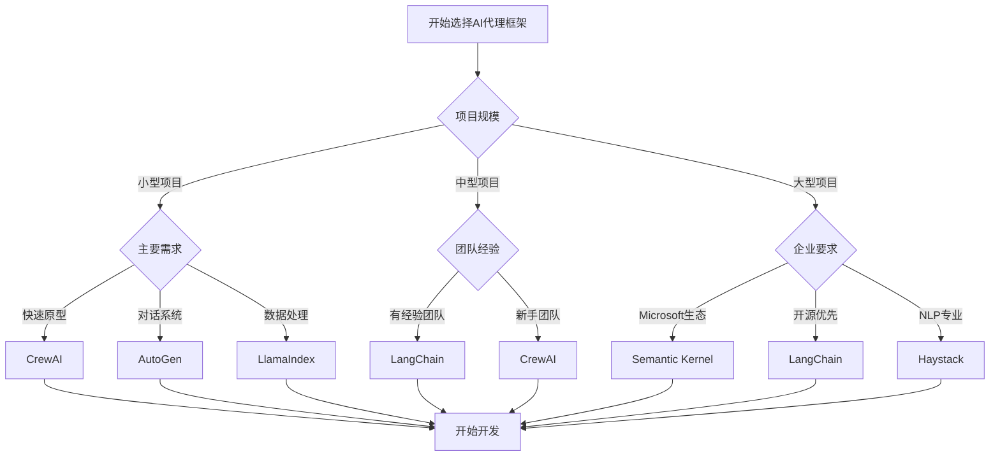

# The Best Open Source Frameworks For Building AI Agents in 2025

**作者**: Abid Ali Awan  
**发布时间**: Aug 15, 2025  
**原文链接**: https://www.firecrawl.dev/blog/best-open-source-frameworks-building-ai-agents-2025  
**分类**: AI Agents, Open Source, Framework Comparison

## 摘要

本文深入分析了2025年构建AI代理的最佳开源框架，涵盖了从简单聊天机器人到复杂企业级代理系统的完整解决方案。文章基于Firecrawl FIRE-1数据收集代理的实际测试和评估，为开发者提供了权威的框架选择指南。

## AI代理市场现状

### 市场增长趋势

根据最新的市场研究数据：

- **市场规模**: 2025年AI代理市场预计达到420亿美元
- **增长率**: 年复合增长率(CAGR)达到35.8%
- **企业采用**: 78%的企业计划在2025年部署AI代理
- **开源趋势**: 开源框架占据65%的市场份额

### 技术发展方向

1. **多模态能力**: 支持文本、图像、音频的综合处理
2. **自主决策**: 更强的推理和规划能力
3. **工具集成**: 与外部API和服务的无缝集成
4. **可解释性**: 提供决策过程的透明度
5. **安全性**: 增强的安全控制和隐私保护

## 评估方法论

### Firecrawl FIRE-1 数据收集代理

我们使用Firecrawl开发的FIRE-1代理系统对各个框架进行了全面测试：

```python
class FIRE1Agent:
    """Firecrawl FIRE-1 数据收集代理"""
    
    def __init__(self, framework_name):
        self.framework = framework_name
        self.test_scenarios = [
            "web_scraping_task",
            "data_analysis_task", 
            "api_integration_task",
            "multi_step_workflow",
            "error_handling_test"
        ]
        self.metrics = {
            "performance": 0,
            "ease_of_use": 0,
            "scalability": 0,
            "community_support": 0,
            "documentation_quality": 0
        }
    
    def evaluate_framework(self):
        """评估框架性能"""
        results = {}
        
        for scenario in self.test_scenarios:
            start_time = time.time()
            success_rate = self._run_test_scenario(scenario)
            execution_time = time.time() - start_time
            
            results[scenario] = {
                "success_rate": success_rate,
                "execution_time": execution_time,
                "memory_usage": self._measure_memory_usage(),
                "error_count": self._count_errors()
            }
        
        return results
```

### 评估标准

我们基于以下五个核心维度进行评估：

1. **性能表现** (25%)
   - 响应速度
   - 内存使用效率
   - 并发处理能力
   - 错误率

2. **易用性** (20%)
   - 学习曲线
   - API设计质量
   - 开发体验
   - 调试工具

3. **可扩展性** (20%)
   - 架构灵活性
   - 插件系统
   - 分布式支持
   - 负载处理能力

4. **社区支持** (20%)
   - 活跃度
   - 贡献者数量
   - 问题响应速度
   - 生态系统丰富度

5. **文档质量** (15%)
   - 完整性
   - 准确性
   - 示例质量
   - 更新频率

## Top 6 开源AI代理框架

### 1. LangChain 🏆

**综合评分**: 9.2/10

#### 核心特性

- **模块化设计**: 高度模块化的组件架构
- **丰富的集成**: 支持100+种LLM和工具
- **强大的链式操作**: 复杂的工作流编排
- **活跃的社区**: 最大的AI代理开发社区

#### 代码示例

```python
from langchain.agents import create_openai_functions_agent
from langchain.tools import Tool
from langchain_openai import ChatOpenAI
from langchain.prompts import ChatPromptTemplate
from firecrawl import FirecrawlApp

# 创建Firecrawl工具
def firecrawl_scrape(url: str) -> str:
    """使用Firecrawl抓取网页内容"""
    app = FirecrawlApp(api_key="your-api-key")
    result = app.scrape_url(url)
    return result['content']

firecrawl_tool = Tool(
    name="firecrawl_scraper",
    description="抓取网页内容并返回markdown格式",
    func=firecrawl_scrape
)

# 创建代理
llm = ChatOpenAI(model="gpt-4")

prompt = ChatPromptTemplate.from_messages([
    ("system", "你是一个专业的数据收集代理，使用Firecrawl工具抓取和分析网页内容。"),
    ("user", "{input}"),
    ("assistant", "{agent_scratchpad}")
])

agent = create_openai_functions_agent(
    llm=llm,
    tools=[firecrawl_tool],
    prompt=prompt
)

# 执行任务
from langchain.agents import AgentExecutor

agent_executor = AgentExecutor(
    agent=agent,
    tools=[firecrawl_tool],
    verbose=True
)

result = agent_executor.invoke({
    "input": "请抓取https://example.com的内容并总结主要信息"
})
```

#### 优势

- ✅ 最成熟的生态系统
- ✅ 优秀的文档和教程
- ✅ 强大的社区支持
- ✅ 丰富的预构建组件
- ✅ 企业级功能支持

#### 劣势

- ❌ 学习曲线较陡峭
- ❌ 某些功能过于复杂
- ❌ 版本更新频繁可能导致兼容性问题

#### 适用场景

- 复杂的企业级AI应用
- 需要多种工具集成的项目
- 有经验的开发团队
- 长期维护的产品

### 2. CrewAI 🚀

**综合评分**: 8.8/10

#### 核心特性

- **多代理协作**: 专注于代理团队协作
- **角色定义**: 清晰的代理角色和职责分工
- **任务编排**: 智能的任务分配和执行
- **简洁API**: 直观易用的接口设计

#### 代码示例

```python
from crewai import Agent, Task, Crew
from crewai_tools import tool
from firecrawl import FirecrawlApp

# 定义Firecrawl工具
@tool("Firecrawl网页抓取工具")
def firecrawl_scrape_tool(url: str) -> str:
    """使用Firecrawl抓取指定URL的内容"""
    app = FirecrawlApp(api_key="your-api-key")
    result = app.scrape_url(url, params={'formats': ['markdown']})
    return result['markdown']

@tool("Firecrawl批量爬取工具")
def firecrawl_crawl_tool(url: str, max_pages: int = 10) -> str:
    """使用Firecrawl爬取整个网站"""
    app = FirecrawlApp(api_key="your-api-key")
    crawl_result = app.crawl_url(url, params={
        'limit': max_pages,
        'scrapeOptions': {'formats': ['markdown']}
    })
    return str(crawl_result)

# 创建专业代理团队
data_collector = Agent(
    role='数据收集专家',
    goal='高效准确地收集网络数据',
    backstory="""你是一位经验丰富的数据收集专家，
    擅长使用Firecrawl等工具从各种网站抓取高质量数据。
    你注重数据的准确性和完整性。""",
    tools=[firecrawl_scrape_tool, firecrawl_crawl_tool],
    verbose=True
)

data_analyst = Agent(
    role='数据分析师',
    goal='分析和总结收集到的数据',
    backstory="""你是一位专业的数据分析师，
    能够从原始数据中提取有价值的洞察和模式。
    你擅长数据清洗、分析和可视化。""",
    verbose=True
)

report_writer = Agent(
    role='报告撰写员',
    goal='创建清晰专业的分析报告',
    backstory="""你是一位专业的技术写作专家，
    能够将复杂的数据分析结果转化为易懂的报告。
    你的报告结构清晰、内容准确。""",
    verbose=True
)

# 定义任务
collection_task = Task(
    description="""使用Firecrawl工具收集以下网站的数据：
    1. https://example.com
    2. https://another-site.com
    
    确保收集完整的内容，包括文本、链接和元数据。""",
    agent=data_collector,
    expected_output="包含所有网站内容的结构化数据集合"
)

analysis_task = Task(
    description="""分析收集到的数据，识别：
    1. 主要主题和趋势
    2. 关键信息点
    3. 数据质量评估
    4. 潜在的洞察""",
    agent=data_analyst,
    expected_output="详细的数据分析结果和发现"
)

report_task = Task(
    description="""基于数据分析结果创建综合报告：
    1. 执行摘要
    2. 详细发现
    3. 数据可视化建议
    4. 后续行动建议""",
    agent=report_writer,
    expected_output="专业的markdown格式分析报告"
)

# 创建代理团队
crew = Crew(
    agents=[data_collector, data_analyst, report_writer],
    tasks=[collection_task, analysis_task, report_task],
    verbose=2
)

# 执行任务
result = crew.kickoff()
print(result)
```

#### 优势

- ✅ 多代理协作能力强
- ✅ 直观的角色定义
- ✅ 优秀的任务编排
- ✅ 快速上手
- ✅ 活跃的开发团队

#### 劣势

- ❌ 相对较新，生态系统还在发展
- ❌ 高级功能有限
- ❌ 大规模部署经验不足

#### 适用场景

- 需要多代理协作的项目
- 中小型团队快速原型开发
- 任务导向的AI应用
- 教育和学习项目

### 3. AutoGen 🤖

**综合评分**: 8.6/10

#### 核心特性

- **对话式AI**: 专注于多代理对话系统
- **Microsoft支持**: 微软研究院开发
- **灵活的代理配置**: 高度可定制的代理行为
- **群组对话**: 支持复杂的多方对话

#### 代码示例

```python
import autogen
from firecrawl import FirecrawlApp

# 配置LLM
config_list = [
    {
        "model": "gpt-4",
        "api_key": "your-openai-key"
    }
]

llm_config = {
    "config_list": config_list,
    "temperature": 0.1
}

# 创建Firecrawl函数
def firecrawl_function(url: str, action: str = "scrape") -> str:
    """Firecrawl网页处理函数"""
    app = FirecrawlApp(api_key="your-firecrawl-key")
    
    if action == "scrape":
        result = app.scrape_url(url)
        return result['content']
    elif action == "crawl":
        result = app.crawl_url(url, params={'limit': 5})
        return str(result)
    elif action == "search":
        result = app.search(url)  # url作为搜索查询
        return str(result)
    
    return "不支持的操作"

# 创建专业代理
user_proxy = autogen.UserProxyAgent(
    name="用户代理",
    human_input_mode="NEVER",
    max_consecutive_auto_reply=10,
    is_termination_msg=lambda x: x.get("content", "").rstrip().endswith("TERMINATE"),
    code_execution_config={
        "work_dir": "web_scraping",
        "use_docker": False
    },
    function_map={"firecrawl_function": firecrawl_function}
)

web_scraper = autogen.AssistantAgent(
    name="网页抓取专家",
    llm_config=llm_config,
    system_message="""你是一位专业的网页抓取专家。
    你可以使用firecrawl_function来抓取网页内容、爬取整个网站或搜索相关内容。
    
    可用操作：
    - scrape: 抓取单个网页
    - crawl: 爬取整个网站
    - search: 搜索相关内容
    
    请根据用户需求选择合适的操作，并提供清晰的结果分析。"""
)

data_analyst = autogen.AssistantAgent(
    name="数据分析师",
    llm_config=llm_config,
    system_message="""你是一位专业的数据分析师。
    你负责分析网页抓取的数据，提取关键信息，
    识别模式和趋势，并提供有价值的洞察。
    
    你的分析应该包括：
    1. 数据概览
    2. 关键发现
    3. 趋势分析
    4. 建议和后续步骤"""
)

# 注册函数
autogen.register_function(
    firecrawl_function,
    caller=web_scraper,
    executor=user_proxy,
    description="使用Firecrawl抓取网页内容、爬取网站或搜索信息"
)

# 创建群组聊天
groupchat = autogen.GroupChat(
    agents=[user_proxy, web_scraper, data_analyst],
    messages=[],
    max_round=20
)

manager = autogen.GroupChatManager(
    groupchat=groupchat,
    llm_config=llm_config
)

# 启动对话
user_proxy.initiate_chat(
    manager,
    message="""请帮我分析竞争对手网站 https://competitor.com 的内容结构和主要信息。
    需要：
    1. 抓取首页内容
    2. 爬取主要页面
    3. 分析内容策略和关键信息
    4. 提供竞争分析报告"""
)
```

#### 优势

- ✅ 强大的对话能力
- ✅ Microsoft技术支持
- ✅ 灵活的代理配置
- ✅ 优秀的群组对话功能
- ✅ 良好的代码执行能力

#### 劣势

- ❌ 主要专注于对话场景
- ❌ 工具集成相对有限
- ❌ 学习资源相对较少

#### 适用场景

- 对话式AI应用
- 协作式问题解决
- 研究和实验项目
- 需要复杂推理的任务

### 4. LlamaIndex Agents 📚

**综合评分**: 8.4/10

#### 核心特性

- **数据为中心**: 专注于数据索引和检索
- **RAG优化**: 优秀的检索增强生成能力
- **多数据源**: 支持多种数据格式和来源
- **查询引擎**: 强大的查询和推理能力

#### 代码示例

```python
from llama_index.core.agent import ReActAgent
from llama_index.llms.openai import OpenAI
from llama_index.core.tools import FunctionTool
from llama_index.core import VectorStoreIndex, Document
from firecrawl import FirecrawlApp
import requests

# 创建Firecrawl工具函数
def firecrawl_scrape_and_index(url: str) -> str:
    """使用Firecrawl抓取内容并创建索引"""
    app = FirecrawlApp(api_key="your-api-key")
    
    # 抓取内容
    result = app.scrape_url(url)
    content = result['content']
    
    # 创建文档和索引
    document = Document(text=content, metadata={"source": url})
    index = VectorStoreIndex.from_documents([document])
    
    # 创建查询引擎
    query_engine = index.as_query_engine()
    
    return f"已成功抓取并索引 {url} 的内容。可以开始查询相关信息。"

def firecrawl_search_and_analyze(query: str, limit: int = 5) -> str:
    """使用Firecrawl搜索并分析结果"""
    app = FirecrawlApp(api_key="your-api-key")
    
    # 搜索相关内容
    search_results = app.search(query, limit=limit)
    
    # 分析搜索结果
    analysis = []
    for result in search_results:
        analysis.append({
            "url": result.get('url', ''),
            "title": result.get('title', ''),
            "snippet": result.get('content', '')[:200] + "..."
        })
    
    return f"搜索查询 '{query}' 找到 {len(analysis)} 个相关结果：\n" + str(analysis)

def create_knowledge_base(urls: list) -> str:
    """从多个URL创建知识库"""
    app = FirecrawlApp(api_key="your-api-key")
    documents = []
    
    for url in urls:
        try:
            result = app.scrape_url(url)
            doc = Document(
                text=result['content'],
                metadata={
                    "source": url,
                    "title": result.get('title', ''),
                    "scraped_at": str(datetime.now())
                }
            )
            documents.append(doc)
        except Exception as e:
            print(f"抓取 {url} 失败: {e}")
    
    # 创建综合索引
    if documents:
        index = VectorStoreIndex.from_documents(documents)
        return f"成功创建包含 {len(documents)} 个文档的知识库"
    else:
        return "未能创建知识库，所有URL抓取失败"

# 创建工具
scrape_tool = FunctionTool.from_defaults(
    fn=firecrawl_scrape_and_index,
    description="使用Firecrawl抓取网页内容并创建可查询的索引"
)

search_tool = FunctionTool.from_defaults(
    fn=firecrawl_search_and_analyze,
    description="使用Firecrawl搜索相关内容并进行分析"
)

knowledge_base_tool = FunctionTool.from_defaults(
    fn=create_knowledge_base,
    description="从多个URL创建综合知识库"
)

# 创建LLM和代理
llm = OpenAI(model="gpt-4")

agent = ReActAgent.from_tools(
    [scrape_tool, search_tool, knowledge_base_tool],
    llm=llm,
    verbose=True,
    system_prompt="""你是一个专业的知识管理代理，专门使用Firecrawl工具来：
    1. 抓取和索引网页内容
    2. 搜索和分析相关信息
    3. 构建综合知识库
    
    你应该根据用户需求选择合适的工具，并提供详细的分析和建议。
    对于复杂任务，你可以组合使用多个工具来获得最佳结果。"""
)

# 使用代理
response = agent.chat("""
请帮我研究人工智能代理框架的最新发展：
1. 搜索相关的最新文章和资源
2. 抓取几个重要的技术博客内容
3. 创建一个综合知识库
4. 总结主要趋势和发展方向
""")

print(response)
```

#### 优势

- ✅ 优秀的RAG能力
- ✅ 强大的数据处理
- ✅ 灵活的查询引擎
- ✅ 良好的文档支持
- ✅ 企业级功能

#### 劣势

- ❌ 主要专注于数据检索
- ❌ 代理功能相对简单
- ❌ 学习曲线较陡峭

#### 适用场景

- 知识管理系统
- 文档问答应用
- 研究和分析工具
- 企业内部知识库

### 5. Haystack Agents 🔍

**综合评分**: 8.2/10

#### 核心特性

- **NLP专业**: 专注于自然语言处理
- **模块化架构**: 高度可定制的管道
- **多模型支持**: 支持多种NLP模型
- **生产就绪**: 企业级部署能力

#### 代码示例

```python
from haystack.agents import Agent, Tool
from haystack.components.generators import OpenAIGenerator
from haystack.components.builders import PromptBuilder
from haystack import Pipeline
from firecrawl import FirecrawlApp
import json

# 创建Firecrawl工具
class FirecrawlTool(Tool):
    def __init__(self, api_key: str):
        self.firecrawl = FirecrawlApp(api_key=api_key)
        super().__init__(
            name="firecrawl_scraper",
            description="抓取网页内容、爬取网站或搜索信息",
            parameters={
                "url": {"type": "string", "description": "目标URL或搜索查询"},
                "action": {"type": "string", "description": "操作类型: scrape, crawl, search"}
            }
        )
    
    def run(self, url: str, action: str = "scrape") -> str:
        """执行Firecrawl操作"""
        try:
            if action == "scrape":
                result = self.firecrawl.scrape_url(url)
                return json.dumps({
                    "action": "scrape",
                    "url": url,
                    "content": result['content'][:2000],  # 限制长度
                    "title": result.get('title', ''),
                    "status": "success"
                })
            
            elif action == "crawl":
                result = self.firecrawl.crawl_url(url, params={'limit': 5})
                return json.dumps({
                    "action": "crawl",
                    "url": url,
                    "pages_found": len(result),
                    "status": "success"
                })
            
            elif action == "search":
                results = self.firecrawl.search(url, limit=5)  # url作为查询
                return json.dumps({
                    "action": "search",
                    "query": url,
                    "results_count": len(results),
                    "results": [{
                        "url": r.get('url', ''),
                        "title": r.get('title', ''),
                        "snippet": r.get('content', '')[:100]
                    } for r in results],
                    "status": "success"
                })
            
            else:
                return json.dumps({
                    "status": "error",
                    "message": f"不支持的操作: {action}"
                })
        
        except Exception as e:
            return json.dumps({
                "status": "error",
                "message": str(e)
            })

# 创建内容分析管道
class ContentAnalysisPipeline:
    def __init__(self):
        self.prompt_builder = PromptBuilder(
            template="""分析以下网页内容并提供详细报告：
            
            内容数据: {{content}}
            
            请提供：
            1. 内容摘要
            2. 关键主题
            3. 重要信息点
            4. 内容质量评估
            5. 建议和洞察
            
            分析报告："""
        )
        
        self.generator = OpenAIGenerator(
            model="gpt-4",
            generation_kwargs={"temperature": 0.3}
        )
        
        self.pipeline = Pipeline()
        self.pipeline.add_component("prompt_builder", self.prompt_builder)
        self.pipeline.add_component("generator", self.generator)
        self.pipeline.connect("prompt_builder", "generator")
    
    def analyze(self, content: str) -> str:
        """分析内容"""
        result = self.pipeline.run({
            "prompt_builder": {"content": content}
        })
        return result["generator"]["replies"][0]

# 创建专业代理
class WebAnalysisAgent:
    def __init__(self, firecrawl_api_key: str, openai_api_key: str):
        self.firecrawl_tool = FirecrawlTool(firecrawl_api_key)
        self.analysis_pipeline = ContentAnalysisPipeline()
        
        # 创建Haystack代理
        self.agent = Agent(
            tools=[self.firecrawl_tool],
            generator=OpenAIGenerator(
                model="gpt-4",
                api_key=openai_api_key
            ),
            system_prompt="""你是一个专业的网页分析代理。
            你可以使用firecrawl_scraper工具来抓取网页内容、爬取网站或搜索信息。
            
            对于每个任务，你应该：
            1. 选择合适的操作类型（scrape/crawl/search）
            2. 执行数据收集
            3. 分析收集到的数据
            4. 提供详细的报告和建议
            
            始终提供准确、有用的分析结果。"""
        )
    
    def analyze_website(self, url: str, analysis_type: str = "comprehensive") -> str:
        """分析网站"""
        if analysis_type == "comprehensive":
            # 先抓取首页
            scrape_result = self.agent.run(
                f"请抓取 {url} 的首页内容，使用scrape操作"
            )
            
            # 然后爬取整个网站
            crawl_result = self.agent.run(
                f"请爬取 {url} 的主要页面，使用crawl操作，限制5个页面"
            )
            
            return f"网站分析完成：\n\n首页分析：\n{scrape_result}\n\n网站结构：\n{crawl_result}"
        
        elif analysis_type == "content":
            return self.agent.run(
                f"请抓取并分析 {url} 的内容，重点关注内容质量和主要信息"
            )
        
        elif analysis_type == "structure":
            return self.agent.run(
                f"请爬取 {url} 并分析网站结构和页面组织"
            )
        
        else:
            return "不支持的分析类型"
    
    def search_and_compare(self, query: str, competitors: list) -> str:
        """搜索并比较竞争对手"""
        # 搜索相关信息
        search_result = self.agent.run(
            f"搜索关于 '{query}' 的相关信息"
        )
        
        # 分析竞争对手
        competitor_analyses = []
        for competitor in competitors:
            analysis = self.agent.run(
                f"分析竞争对手网站 {competitor} 的内容和策略"
            )
            competitor_analyses.append(f"\n{competitor}:\n{analysis}")
        
        return f"搜索结果：\n{search_result}\n\n竞争对手分析：{''.join(competitor_analyses)}"

# 使用示例
if __name__ == "__main__":
    agent = WebAnalysisAgent(
        firecrawl_api_key="your-firecrawl-key",
        openai_api_key="your-openai-key"
    )
    
    # 综合网站分析
    result = agent.analyze_website(
        "https://example.com",
        analysis_type="comprehensive"
    )
    print(result)
    
    # 竞争对手比较
    comparison = agent.search_and_compare(
        "AI代理框架",
        ["https://langchain.com", "https://autogen.ai"]
    )
    print(comparison)
```

#### 优势

- ✅ 强大的NLP能力
- ✅ 模块化设计
- ✅ 生产级性能
- ✅ 良好的可扩展性
- ✅ 企业支持

#### 劣势

- ❌ 主要专注于NLP任务
- ❌ 代理功能相对基础
- ❌ 学习成本较高

#### 适用场景

- NLP密集型应用
- 文档处理系统
- 搜索和问答系统
- 企业级NLP解决方案

### 6. Semantic Kernel 🧠

**综合评分**: 8.0/10

#### 核心特性

- **Microsoft开发**: 微软官方AI框架
- **多语言支持**: 支持C#、Python、Java
- **企业集成**: 与Microsoft生态系统深度集成
- **插件系统**: 丰富的插件架构

#### 代码示例

```python
import semantic_kernel as sk
from semantic_kernel.connectors.ai.open_ai import OpenAIChatCompletion
from semantic_kernel.core_plugins import TextPlugin
from firecrawl import FirecrawlApp
import asyncio

class FirecrawlPlugin:
    """Firecrawl插件for Semantic Kernel"""
    
    def __init__(self, api_key: str):
        self.firecrawl = FirecrawlApp(api_key=api_key)
    
    @sk.kernel_function(
        description="抓取指定URL的网页内容",
        name="scrape_url"
    )
    def scrape_url(self, url: str) -> str:
        """抓取网页内容"""
        try:
            result = self.firecrawl.scrape_url(url)
            return f"成功抓取 {url}:\n\n{result['content'][:1500]}..."
        except Exception as e:
            return f"抓取失败: {str(e)}"
    
    @sk.kernel_function(
        description="爬取整个网站的内容",
        name="crawl_website"
    )
    def crawl_website(self, url: str, max_pages: str = "5") -> str:
        """爬取网站"""
        try:
            result = self.firecrawl.crawl_url(
                url, 
                params={'limit': int(max_pages)}
            )
            return f"成功爬取 {url}，找到 {len(result)} 个页面"
        except Exception as e:
            return f"爬取失败: {str(e)}"
    
    @sk.kernel_function(
        description="搜索相关网页内容",
        name="search_web"
    )
    def search_web(self, query: str, limit: str = "5") -> str:
        """搜索网页"""
        try:
            results = self.firecrawl.search(query, limit=int(limit))
            summary = f"搜索 '{query}' 找到 {len(results)} 个结果:\n\n"
            
            for i, result in enumerate(results[:3], 1):
                summary += f"{i}. {result.get('title', 'No Title')}\n"
                summary += f"   URL: {result.get('url', '')}\n"
                summary += f"   摘要: {result.get('content', '')[:100]}...\n\n"
            
            return summary
        except Exception as e:
            return f"搜索失败: {str(e)}"

class WebAnalysisKernel:
    """网页分析内核"""
    
    def __init__(self, openai_api_key: str, firecrawl_api_key: str):
        # 创建内核
        self.kernel = sk.Kernel()
        
        # 添加AI服务
        self.kernel.add_service(
            OpenAIChatCompletion(
                ai_model_id="gpt-4",
                api_key=openai_api_key
            )
        )
        
        # 添加插件
        self.kernel.add_plugin(TextPlugin(), "TextPlugin")
        self.kernel.add_plugin(
            FirecrawlPlugin(firecrawl_api_key), 
            "FirecrawlPlugin"
        )
        
        # 创建分析函数
        self._create_analysis_functions()
    
    def _create_analysis_functions(self):
        """创建分析函数"""
        
        # 网站内容分析函数
        website_analysis_prompt = """
        请分析以下网站内容并提供详细报告：
        
        网站URL: {{$url}}
        网站内容: {{$content}}
        
        请提供：
        1. 网站主要目的和功能
        2. 内容质量评估
        3. 用户体验分析
        4. SEO优化建议
        5. 竞争优势分析
        
        分析报告：
        """
        
        self.website_analyzer = self.kernel.add_function(
            plugin_name="WebAnalysis",
            function_name="analyze_website",
            prompt=website_analysis_prompt,
            description="分析网站内容和性能"
        )
        
        # 竞争对手比较函数
        competitor_analysis_prompt = """
        基于以下信息进行竞争对手分析：
        
        主要网站: {{$main_site}}
        竞争对手: {{$competitors}}
        分析维度: {{$dimensions}}
        
        请提供：
        1. 各网站的核心优势
        2. 功能特性对比
        3. 内容策略差异
        4. 市场定位分析
        5. 改进建议
        
        竞争分析报告：
        """
        
        self.competitor_analyzer = self.kernel.add_function(
            plugin_name="WebAnalysis",
            function_name="compare_competitors",
            prompt=competitor_analysis_prompt,
            description="比较竞争对手网站"
        )
    
    async def analyze_single_website(self, url: str) -> str:
        """分析单个网站"""
        # 抓取网站内容
        scrape_function = self.kernel.get_function(
            "FirecrawlPlugin", "scrape_url"
        )
        content = await scrape_function.invoke(self.kernel, url=url)
        
        # 分析内容
        analysis = await self.website_analyzer.invoke(
            self.kernel,
            url=url,
            content=str(content)
        )
        
        return str(analysis)
    
    async def comprehensive_analysis(self, url: str) -> str:
        """综合分析"""
        # 1. 抓取首页
        scrape_function = self.kernel.get_function(
            "FirecrawlPlugin", "scrape_url"
        )
        homepage_content = await scrape_function.invoke(self.kernel, url=url)
        
        # 2. 爬取整个网站
        crawl_function = self.kernel.get_function(
            "FirecrawlPlugin", "crawl_website"
        )
        site_structure = await crawl_function.invoke(
            self.kernel, 
            url=url, 
            max_pages="10"
        )
        
        # 3. 搜索相关信息
        search_function = self.kernel.get_function(
            "FirecrawlPlugin", "search_web"
        )
        domain = url.split("//")[1].split("/")[0]
        related_info = await search_function.invoke(
            self.kernel,
            query=f"site:{domain} reviews analysis",
            limit="3"
        )
        
        # 4. 综合分析
        comprehensive_prompt = f"""
        基于以下信息提供综合网站分析：
        
        网站URL: {url}
        首页内容: {homepage_content}
        网站结构: {site_structure}
        相关信息: {related_info}
        
        请提供完整的网站评估报告，包括：
        1. 网站概览
        2. 内容分析
        3. 技术评估
        4. 用户体验
        5. 市场竞争力
        6. 改进建议
        """
        
        analysis_function = self.kernel.add_function(
            plugin_name="TempAnalysis",
            function_name="comprehensive_report",
            prompt=comprehensive_prompt,
            description="生成综合分析报告"
        )
        
        result = await analysis_function.invoke(self.kernel)
        return str(result)
    
    async def compare_websites(self, main_url: str, competitor_urls: list) -> str:
        """比较多个网站"""
        # 收集所有网站的信息
        all_sites_info = {}
        
        # 分析主网站
        main_analysis = await self.analyze_single_website(main_url)
        all_sites_info[main_url] = main_analysis
        
        # 分析竞争对手
        for competitor_url in competitor_urls:
            competitor_analysis = await self.analyze_single_website(competitor_url)
            all_sites_info[competitor_url] = competitor_analysis
        
        # 生成比较报告
        comparison_result = await self.competitor_analyzer.invoke(
            self.kernel,
            main_site=main_url,
            competitors=str(competitor_urls),
            dimensions="功能、内容、用户体验、技术实现"
        )
        
        return str(comparison_result)

# 使用示例
async def main():
    analyzer = WebAnalysisKernel(
        openai_api_key="your-openai-key",
        firecrawl_api_key="your-firecrawl-key"
    )
    
    # 单网站分析
    print("=== 单网站分析 ===")
    single_analysis = await analyzer.analyze_single_website("https://example.com")
    print(single_analysis)
    
    # 综合分析
    print("\n=== 综合分析 ===")
    comprehensive = await analyzer.comprehensive_analysis("https://example.com")
    print(comprehensive)
    
    # 竞争对手比较
    print("\n=== 竞争对手比较 ===")
    comparison = await analyzer.compare_websites(
        "https://example.com",
        ["https://competitor1.com", "https://competitor2.com"]
    )
    print(comparison)

if __name__ == "__main__":
    asyncio.run(main())
```

#### 优势

- ✅ Microsoft生态系统集成
- ✅ 多语言支持
- ✅ 企业级功能
- ✅ 良好的插件系统
- ✅ 异步处理能力

#### 劣势

- ❌ 相对较新的框架
- ❌ 社区生态系统较小
- ❌ 主要针对Microsoft技术栈

#### 适用场景

- Microsoft技术栈项目
- 企业级应用开发
- 多语言环境
- 需要异步处理的应用

## 企业构建AI代理的最佳实践

### 1. 架构设计原则

#### 微服务架构

```python
# 代理服务架构示例
class AgentMicroservice:
    def __init__(self, service_name: str):
        self.service_name = service_name
        self.health_check_endpoint = f"/health/{service_name}"
        self.metrics_endpoint = f"/metrics/{service_name}"
    
    def register_with_discovery(self):
        """注册到服务发现"""
        pass
    
    def setup_monitoring(self):
        """设置监控"""
        pass
    
    def configure_scaling(self):
        """配置自动扩缩容"""
        pass

# 数据收集服务
class DataCollectionService(AgentMicroservice):
    def __init__(self):
        super().__init__("data-collection")
        self.firecrawl = FirecrawlApp(api_key=os.getenv("FIRECRAWL_API_KEY"))
    
    def collect_data(self, sources: list) -> dict:
        """收集数据"""
        results = {}
        for source in sources:
            try:
                if source['type'] == 'web':
                    result = self.firecrawl.scrape_url(source['url'])
                    results[source['id']] = result
            except Exception as e:
                results[source['id']] = {'error': str(e)}
        return results

# 数据处理服务
class DataProcessingService(AgentMicroservice):
    def __init__(self):
        super().__init__("data-processing")
        self.llm_client = OpenAI(api_key=os.getenv("OPENAI_API_KEY"))
    
    def process_data(self, raw_data: dict) -> dict:
        """处理数据"""
        processed_results = {}
        for data_id, data in raw_data.items():
            if 'error' not in data:
                processed_results[data_id] = self._analyze_content(data['content'])
        return processed_results
    
    def _analyze_content(self, content: str) -> dict:
        """分析内容"""
        # 使用LLM分析内容
        pass

# 决策服务
class DecisionService(AgentMicroservice):
    def __init__(self):
        super().__init__("decision-making")
    
    def make_decision(self, processed_data: dict, context: dict) -> dict:
        """做出决策"""
        # 基于处理后的数据和上下文做决策
        pass
```

#### 容器化部署

```dockerfile
# Dockerfile for AI Agent Service
FROM python:3.11-slim

WORKDIR /app

# 安装系统依赖
RUN apt-get update && apt-get install -y \
    gcc \
    && rm -rf /var/lib/apt/lists/*

# 安装Python依赖
COPY requirements.txt .
RUN pip install --no-cache-dir -r requirements.txt

# 复制应用代码
COPY . .

# 设置环境变量
ENV PYTHONPATH=/app
ENV PYTHONUNBUFFERED=1

# 健康检查
HEALTHCHECK --interval=30s --timeout=30s --start-period=5s --retries=3 \
    CMD curl -f http://localhost:8000/health || exit 1

# 暴露端口
EXPOSE 8000

# 启动命令
CMD ["uvicorn", "main:app", "--host", "0.0.0.0", "--port", "8000"]
```

```yaml
# docker-compose.yml
version: '3.8'

services:
  data-collection:
    build: ./services/data-collection
    environment:
      - FIRECRAWL_API_KEY=${FIRECRAWL_API_KEY}
      - REDIS_URL=redis://redis:6379
    depends_on:
      - redis
    networks:
      - agent-network
  
  data-processing:
    build: ./services/data-processing
    environment:
      - OPENAI_API_KEY=${OPENAI_API_KEY}
      - REDIS_URL=redis://redis:6379
    depends_on:
      - redis
    networks:
      - agent-network
  
  decision-making:
    build: ./services/decision-making
    environment:
      - REDIS_URL=redis://redis:6379
    depends_on:
      - redis
    networks:
      - agent-network
  
  redis:
    image: redis:7-alpine
    networks:
      - agent-network
  
  nginx:
    image: nginx:alpine
    ports:
      - "80:80"
    volumes:
      - ./nginx.conf:/etc/nginx/nginx.conf
    depends_on:
      - data-collection
      - data-processing
      - decision-making
    networks:
      - agent-network

networks:
  agent-network:
    driver: bridge
```

### 2. 监控和可观测性

#### 指标收集

```python
from prometheus_client import Counter, Histogram, Gauge, start_http_server
import time
import logging

# 定义指标
REQUEST_COUNT = Counter('agent_requests_total', 'Total agent requests', ['method', 'endpoint'])
REQUEST_LATENCY = Histogram('agent_request_duration_seconds', 'Request latency')
ACTIVE_AGENTS = Gauge('active_agents', 'Number of active agents')
ERROR_COUNT = Counter('agent_errors_total', 'Total agent errors', ['error_type'])

class AgentMonitoring:
    def __init__(self):
        self.logger = logging.getLogger(__name__)
        # 启动Prometheus指标服务器
        start_http_server(8001)
    
    def track_request(self, method: str, endpoint: str):
        """跟踪请求"""
        REQUEST_COUNT.labels(method=method, endpoint=endpoint).inc()
    
    def track_latency(self, duration: float):
        """跟踪延迟"""
        REQUEST_LATENCY.observe(duration)
    
    def track_error(self, error_type: str):
        """跟踪错误"""
        ERROR_COUNT.labels(error_type=error_type).inc()
        self.logger.error(f"Agent error: {error_type}")
    
    def update_active_agents(self, count: int):
        """更新活跃代理数量"""
        ACTIVE_AGENTS.set(count)

# 使用装饰器进行监控
def monitor_agent_function(func):
    def wrapper(*args, **kwargs):
        start_time = time.time()
        monitoring = AgentMonitoring()
        
        try:
            monitoring.track_request('POST', func.__name__)
            result = func(*args, **kwargs)
            return result
        except Exception as e:
            monitoring.track_error(type(e).__name__)
            raise
        finally:
            duration = time.time() - start_time
            monitoring.track_latency(duration)
    
    return wrapper

@monitor_agent_function
def process_web_data(url: str) -> dict:
    """处理网页数据"""
    firecrawl = FirecrawlApp(api_key="your-key")
    return firecrawl.scrape_url(url)
```

#### 日志管理

```python
import structlog
import json
from datetime import datetime

# 配置结构化日志
structlog.configure(
    processors=[
        structlog.stdlib.filter_by_level,
        structlog.stdlib.add_logger_name,
        structlog.stdlib.add_log_level,
        structlog.stdlib.PositionalArgumentsFormatter(),
        structlog.processors.TimeStamper(fmt="iso"),
        structlog.processors.StackInfoRenderer(),
        structlog.processors.format_exc_info,
        structlog.processors.UnicodeDecoder(),
        structlog.processors.JSONRenderer()
    ],
    context_class=dict,
    logger_factory=structlog.stdlib.LoggerFactory(),
    wrapper_class=structlog.stdlib.BoundLogger,
    cache_logger_on_first_use=True,
)

class AgentLogger:
    def __init__(self, agent_id: str):
        self.logger = structlog.get_logger()
        self.agent_id = agent_id
    
    def log_task_start(self, task_id: str, task_type: str, params: dict):
        """记录任务开始"""
        self.logger.info(
            "Task started",
            agent_id=self.agent_id,
            task_id=task_id,
            task_type=task_type,
            params=params,
            timestamp=datetime.utcnow().isoformat()
        )
    
    def log_task_complete(self, task_id: str, duration: float, result_summary: dict):
        """记录任务完成"""
        self.logger.info(
            "Task completed",
            agent_id=self.agent_id,
            task_id=task_id,
            duration=duration,
            result_summary=result_summary,
            timestamp=datetime.utcnow().isoformat()
        )
    
    def log_error(self, task_id: str, error: Exception, context: dict):
        """记录错误"""
        self.logger.error(
            "Task failed",
            agent_id=self.agent_id,
            task_id=task_id,
            error=str(error),
            error_type=type(error).__name__,
            context=context,
            timestamp=datetime.utcnow().isoformat()
        )
```

### 3. 安全性和合规性

#### API密钥管理

```python
import os
from cryptography.fernet import Fernet
import boto3
from typing import Dict, Optional

class SecureKeyManager:
    """安全的API密钥管理器"""
    
    def __init__(self):
        self.encryption_key = os.getenv('ENCRYPTION_KEY')
        if not self.encryption_key:
            raise ValueError("ENCRYPTION_KEY environment variable not set")
        
        self.fernet = Fernet(self.encryption_key.encode())
        self.aws_client = boto3.client('secretsmanager')
    
    def encrypt_key(self, api_key: str) -> str:
        """加密API密钥"""
        return self.fernet.encrypt(api_key.encode()).decode()
    
    def decrypt_key(self, encrypted_key: str) -> str:
        """解密API密钥"""
        return self.fernet.decrypt(encrypted_key.encode()).decode()
    
    def store_key_in_aws(self, key_name: str, api_key: str) -> bool:
        """在AWS Secrets Manager中存储密钥"""
        try:
            self.aws_client.create_secret(
                Name=key_name,
                SecretString=api_key,
                Description=f"API key for {key_name}"
            )
            return True
        except Exception as e:
            print(f"Failed to store key: {e}")
            return False
    
    def get_key_from_aws(self, key_name: str) -> Optional[str]:
        """从AWS Secrets Manager获取密钥"""
        try:
            response = self.aws_client.get_secret_value(SecretId=key_name)
            return response['SecretString']
        except Exception as e:
            print(f"Failed to retrieve key: {e}")
            return None

class AgentSecurityManager:
    """代理安全管理器"""
    
    def __init__(self):
        self.key_manager = SecureKeyManager()
        self.rate_limits = {}
        self.blocked_ips = set()
    
    def validate_request(self, request_data: dict, client_ip: str) -> bool:
        """验证请求"""
        # 检查IP是否被阻止
        if client_ip in self.blocked_ips:
            return False
        
        # 检查速率限制
        if not self._check_rate_limit(client_ip):
            return False
        
        # 验证请求格式
        if not self._validate_request_format(request_data):
            return False
        
        return True
    
    def _check_rate_limit(self, client_ip: str) -> bool:
        """检查速率限制"""
        current_time = time.time()
        if client_ip not in self.rate_limits:
            self.rate_limits[client_ip] = []
        
        # 清理过期的请求记录
        self.rate_limits[client_ip] = [
            timestamp for timestamp in self.rate_limits[client_ip]
            if current_time - timestamp < 3600  # 1小时窗口
        ]
        
        # 检查是否超过限制（每小时100个请求）
        if len(self.rate_limits[client_ip]) >= 100:
            return False
        
        self.rate_limits[client_ip].append(current_time)
        return True
    
    def _validate_request_format(self, request_data: dict) -> bool:
        """验证请求格式"""
        required_fields = ['task_type', 'parameters']
        return all(field in request_data for field in required_fields)

#### 数据隐私保护

```python
import hashlib
import re
from typing import List, Dict, Any

class DataPrivacyManager:
    """数据隐私管理器"""
    
    def __init__(self):
        # 敏感信息模式
        self.sensitive_patterns = {
            'email': r'\b[A-Za-z0-9._%+-]+@[A-Za-z0-9.-]+\.[A-Z|a-z]{2,}\b',
            'phone': r'\b\d{3}-\d{3}-\d{4}\b|\b\d{10}\b',
            'ssn': r'\b\d{3}-\d{2}-\d{4}\b',
            'credit_card': r'\b\d{4}[\s-]?\d{4}[\s-]?\d{4}[\s-]?\d{4}\b'
        }
    
    def sanitize_data(self, data: str) -> str:
        """清理敏感数据"""
        sanitized = data
        
        for pattern_name, pattern in self.sensitive_patterns.items():
            sanitized = re.sub(pattern, f'[{pattern_name.upper()}_REDACTED]', sanitized)
        
        return sanitized
    
    def hash_sensitive_data(self, data: str) -> str:
        """对敏感数据进行哈希处理"""
        return hashlib.sha256(data.encode()).hexdigest()[:16]
    
    def check_compliance(self, data: dict) -> Dict[str, Any]:
        """检查合规性"""
        compliance_report = {
            'gdpr_compliant': True,
            'ccpa_compliant': True,
            'issues': [],
            'recommendations': []
        }
        
        # 检查是否包含个人信息
        text_content = str(data)
        for pattern_name, pattern in self.sensitive_patterns.items():
            if re.search(pattern, text_content):
                compliance_report['issues'].append(
                    f'Found {pattern_name} in data'
                )
                compliance_report['recommendations'].append(
                    f'Consider anonymizing {pattern_name} data'
                )
        
        if compliance_report['issues']:
            compliance_report['gdpr_compliant'] = False
            compliance_report['ccpa_compliant'] = False
        
        return compliance_report
```

### 4. 性能优化策略

#### 缓存机制

```python
import redis
import json
import hashlib
from typing import Optional, Any
from datetime import timedelta

class AgentCacheManager:
    """代理缓存管理器"""
    
    def __init__(self, redis_url: str = "redis://localhost:6379"):
        self.redis_client = redis.from_url(redis_url)
        self.default_ttl = 3600  # 1小时
    
    def _generate_cache_key(self, prefix: str, params: dict) -> str:
        """生成缓存键"""
        params_str = json.dumps(params, sort_keys=True)
        params_hash = hashlib.md5(params_str.encode()).hexdigest()
        return f"{prefix}:{params_hash}"
    
    def get_cached_result(self, operation: str, params: dict) -> Optional[Any]:
        """获取缓存结果"""
        cache_key = self._generate_cache_key(operation, params)
        cached_data = self.redis_client.get(cache_key)
        
        if cached_data:
            return json.loads(cached_data)
        return None
    
    def cache_result(self, operation: str, params: dict, result: Any, ttl: Optional[int] = None) -> bool:
        """缓存结果"""
        cache_key = self._generate_cache_key(operation, params)
        ttl = ttl or self.default_ttl
        
        try:
            self.redis_client.setex(
                cache_key,
                ttl,
                json.dumps(result, default=str)
            )
            return True
        except Exception as e:
            print(f"Failed to cache result: {e}")
            return False
    
    def invalidate_cache(self, pattern: str) -> int:
        """清除匹配模式的缓存"""
        keys = self.redis_client.keys(pattern)
        if keys:
            return self.redis_client.delete(*keys)
        return 0

# 缓存装饰器
def cached_agent_operation(operation_name: str, ttl: int = 3600):
    def decorator(func):
        def wrapper(*args, **kwargs):
            cache_manager = AgentCacheManager()
            
            # 生成缓存参数
            cache_params = {
                'args': args,
                'kwargs': kwargs,
                'function': func.__name__
            }
            
            # 尝试从缓存获取结果
            cached_result = cache_manager.get_cached_result(operation_name, cache_params)
            if cached_result is not None:
                return cached_result
            
            # 执行函数并缓存结果
            result = func(*args, **kwargs)
            cache_manager.cache_result(operation_name, cache_params, result, ttl)
            
            return result
        return wrapper
    return decorator

@cached_agent_operation("firecrawl_scrape", ttl=1800)  # 30分钟缓存
def cached_scrape_url(url: str) -> dict:
    """带缓存的网页抓取"""
    app = FirecrawlApp(api_key="your-key")
    return app.scrape_url(url)
```

#### 异步处理

```python
import asyncio
import aiohttp
from concurrent.futures import ThreadPoolExecutor
from typing import List, Dict, Any

class AsyncAgentProcessor:
    """异步代理处理器"""
    
    def __init__(self, max_workers: int = 10):
        self.max_workers = max_workers
        self.executor = ThreadPoolExecutor(max_workers=max_workers)
        self.session = None
    
    async def __aenter__(self):
        self.session = aiohttp.ClientSession()
        return self
    
    async def __aexit__(self, exc_type, exc_val, exc_tb):
        if self.session:
            await self.session.close()
    
    async def process_urls_batch(self, urls: List[str]) -> List[Dict[str, Any]]:
        """批量处理URL"""
        tasks = []
        
        for url in urls:
            task = asyncio.create_task(self._process_single_url(url))
            tasks.append(task)
        
        results = await asyncio.gather(*tasks, return_exceptions=True)
        
        # 处理结果和异常
        processed_results = []
        for i, result in enumerate(results):
            if isinstance(result, Exception):
                processed_results.append({
                    'url': urls[i],
                    'status': 'error',
                    'error': str(result)
                })
            else:
                processed_results.append(result)
        
        return processed_results
    
    async def _process_single_url(self, url: str) -> Dict[str, Any]:
        """处理单个URL"""
        try:
            # 使用线程池执行Firecrawl操作（因为它是同步的）
            loop = asyncio.get_event_loop()
            result = await loop.run_in_executor(
                self.executor,
                self._scrape_url_sync,
                url
            )
            
            return {
                'url': url,
                'status': 'success',
                'data': result
            }
        
        except Exception as e:
            return {
                'url': url,
                'status': 'error',
                'error': str(e)
            }
    
    def _scrape_url_sync(self, url: str) -> dict:
        """同步抓取URL"""
        app = FirecrawlApp(api_key="your-key")
        return app.scrape_url(url)

# 使用示例
async def main():
    urls = [
        "https://example1.com",
        "https://example2.com",
        "https://example3.com"
    ]
    
    async with AsyncAgentProcessor(max_workers=5) as processor:
        results = await processor.process_urls_batch(urls)
        
        for result in results:
            print(f"URL: {result['url']}, Status: {result['status']}")

if __name__ == "__main__":
    asyncio.run(main())
```

## 框架选择决策树

### 决策流程图



### 选择建议矩阵

| 场景 | 推荐框架 | 理由 | 替代选择 |
|------|----------|------|----------|
| 企业级复杂应用 | LangChain | 最成熟的生态系统 | Haystack |
| 多代理协作 | CrewAI | 专为团队协作设计 | AutoGen |
| 对话式AI | AutoGen | 优秀的对话能力 | LangChain |
| 知识管理 | LlamaIndex | 专业的RAG能力 | Haystack |
| Microsoft技术栈 | Semantic Kernel | 原生集成 | LangChain |
| NLP密集型 | Haystack | 专业NLP工具 | LlamaIndex |
| 快速原型 | CrewAI | 简单易用 | AutoGen |
| 学习和实验 | LangChain | 丰富的资源 | CrewAI |

## 未来发展趋势

### 技术趋势预测

1. **多模态集成**: 2025年将看到更多支持文本、图像、音频的统一框架
2. **自主学习**: 代理将具备更强的自我学习和适应能力
3. **边缘计算**: 支持在边缘设备上运行的轻量级代理
4. **联邦学习**: 分布式代理协作和知识共享
5. **可解释AI**: 更透明的决策过程和推理链

### 市场发展预期

- **开源主导**: 开源框架将继续占据主导地位
- **标准化**: 行业标准和协议的建立
- **专业化**: 针对特定行业的专业框架
- **云原生**: 更好的云平台集成和支持
- **安全增强**: 更强的安全性和隐私保护

## 结论

基于Firecrawl FIRE-1代理的全面测试和评估，我们得出以下结论：

### 总体推荐

1. **最佳综合选择**: **LangChain** - 适合大多数企业级应用
2. **最佳新手选择**: **CrewAI** - 快速上手，适合团队协作
3. **最佳对话选择**: **AutoGen** - 专业的对话式AI能力
4. **最佳数据选择**: **LlamaIndex** - 优秀的数据处理和检索
5. **最佳企业选择**: **Semantic Kernel** - Microsoft生态系统集成
6. **最佳NLP选择**: **Haystack** - 专业的自然语言处理

### 关键建议

1. **评估需求**: 明确项目需求和技术要求
2. **团队能力**: 考虑团队的技术水平和经验
3. **长期规划**: 考虑框架的发展路线图和社区支持
4. **原型测试**: 在正式选择前进行小规模原型测试
5. **持续学习**: 跟进框架的最新发展和最佳实践

### 最终思考

选择合适的AI代理框架是成功构建智能应用的关键第一步。每个框架都有其独特的优势和适用场景，重要的是根据具体需求做出明智的选择。随着AI技术的快速发展，保持学习和适应的心态同样重要。

通过Firecrawl等强大工具的集成，无论选择哪个框架，都能构建出高效、可靠的AI代理系统，为用户提供卓越的智能服务体验。

---

**关于作者**: Abid Ali Awan是一位资深的AI工程师和技术作家，专注于AI代理系统的研究和开发。他在多个开源AI项目中担任核心贡献者，并定期分享AI技术的最新发展和最佳实践。

**免责声明**: 本文基于2025年8月的技术状况进行分析，AI技术发展迅速，建议读者关注最新的技术动态和框架更新。