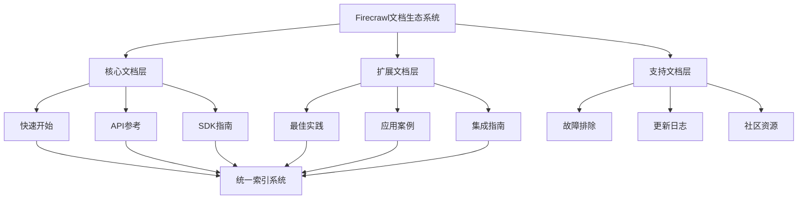
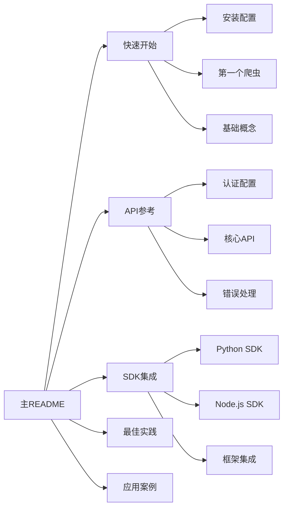

# 架构设计 - Firecrawl文档整理

## 🏗️ 系统架构设计

### 整体架构原则
1. **层次化结构**：按用户使用路径组织文档
2. **模块化设计**：每个模块独立完整
3. **渐进式学习**：从基础到高级的学习路径
4. **交叉引用**：建立文档间的有机联系

### 技术架构



## 📁 新文档结构设计

### 目标结构
```
Firecrawl官方文档/
├── README.md                          # 主入口和导航
├── 📚 01-快速开始/
│   ├── README.md                      # 快速开始导航
│   ├── 安装与配置.md
│   ├── 第一个爬虫.md
│   ├── 基础概念.md
│   └── 常见问题.md
├── 📖 02-API参考/
│   ├── README.md                      # API导航
│   ├── 认证与配置.md
│   ├── Scrape-单页抓取.md
│   ├── Crawl-网站爬取.md
│   ├── Map-链接发现.md
│   ├── Search-搜索功能.md
│   ├── Extract-数据提取.md
│   └── 错误处理.md
├── 🛠️ 03-SDK与集成/
│   ├── README.md                      # SDK导航
│   ├── Python-SDK.md
│   ├── NodeJS-SDK.md
│   ├── Go-SDK.md
│   ├── 框架集成.md
│   └── 自定义集成.md
├── 💡 04-最佳实践/
│   ├── README.md                      # 最佳实践导航
│   ├── 性能优化.md
│   ├── 错误处理策略.md
│   ├── 安全防护.md
│   ├── 成本控制.md
│   └── 监控与日志.md
├── 🎯 05-应用案例/
│   ├── README.md                      # 案例导航
│   ├── 新闻采集系统.md
│   ├── 电商监控.md
│   ├── 学术研究.md
│   ├── 数据分析.md
│   └── 企业应用.md
├── 🔧 06-高级功能/
│   ├── README.md                      # 高级功能导航
│   ├── 自定义抓取规则.md
│   ├── 批量处理.md
│   ├── 实时监控.md
│   └── 扩展开发.md
├── 📋 07-参考资料/
│   ├── README.md                      # 参考资料导航
│   ├── API完整参考.md
│   ├── 配置参数表.md
│   ├── 错误代码表.md
│   └── 更新日志.md
└── 🌐 08-社区与支持/
    ├── README.md                      # 社区导航
    ├── 社区资源.md
    ├── 贡献指南.md
    ├── 问题反馈.md
    └── 博客文章.md
```

## 🎨 设计规范

### 文件命名规范
1. **目录命名**：`序号-中文名称/`（如：`01-快速开始/`）
2. **文件命名**：`功能描述.md`（如：`Scrape-单页抓取.md`）
3. **README文件**：每个目录都有README.md作为导航
4. **特殊标识**：使用emoji增强可读性

### 内容组织规范
1. **统一模板**：每个文档都遵循统一的结构模板
2. **交叉引用**：使用相对路径进行文档间引用
3. **代码示例**：每个功能都提供完整的代码示例
4. **多语言支持**：保持中英文对照

### 导航设计


## 🔗 链接策略

### 内部链接规范
```markdown
# 相对路径引用示例
[快速开始](../01-快速开始/README.md)
[API参考](../02-API参考/Scrape-单页抓取.md)
[Python SDK](../03-SDK与集成/Python-SDK.md)
```

### 外部链接管理
- 官方文档链接：保持最新版本
- 社区资源链接：定期检查有效性
- 代码仓库链接：指向稳定版本

## 📊 索引系统设计

### 功能索引
```markdown
## 🔍 功能快速索引

### 核心功能
- [单页抓取 Scrape](02-API参考/Scrape-单页抓取.md)
- [网站爬取 Crawl](02-API参考/Crawl-网站爬取.md)
- [链接发现 Map](02-API参考/Map-链接发现.md)
- [搜索功能 Search](02-API参考/Search-搜索功能.md)
- [数据提取 Extract](02-API参考/Extract-数据提取.md)

### SDK支持
- [Python SDK](03-SDK与集成/Python-SDK.md)
- [Node.js SDK](03-SDK与集成/NodeJS-SDK.md)
- [Go SDK](03-SDK与集成/Go-SDK.md)

### 应用场景
- [新闻采集](05-应用案例/新闻采集系统.md)
- [电商监控](05-应用案例/电商监控.md)
- [学术研究](05-应用案例/学术研究.md)
```

### 问题索引
```markdown
## ❓ 常见问题索引

### 安装问题
- [API密钥配置](01-快速开始/安装与配置.md#api密钥配置)
- [依赖安装失败](01-快速开始/常见问题.md#依赖问题)

### 使用问题
- [抓取失败](04-最佳实践/错误处理策略.md#抓取失败)
- [性能优化](04-最佳实践/性能优化.md)
- [反爬虫应对](04-最佳实践/安全防护.md#反爬虫)
```

## 🎯 用户体验设计

### 学习路径
1. **新手路径**：快速开始 → 第一个爬虫 → 基础API → 简单案例
2. **进阶路径**：完整API → SDK集成 → 最佳实践 → 复杂案例
3. **专家路径**：高级功能 → 自定义开发 → 性能优化 → 架构设计

### 搜索优化
- 关键词标签系统
- 全文搜索支持
- 智能推荐相关文档

## 🔧 技术实现

### 文档生成工具
- Markdown处理器
- 自动目录生成
- 链接检查工具
- 格式验证器

### 维护工具
- 文档同步脚本
- 链接检查自动化
- 内容更新通知
- 版本控制集成

---

*架构设计完成时间：2024年*
*基于6A工作流方法论 - 阶段2：Architect（架构）*