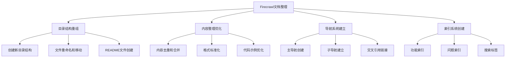

# 任务树 - Firecrawl文档整理

## 🌳 任务层级结构



## ✅ 原子任务清单

### 阶段A：目录结构重组 (预估时间: 30分钟)

#### A1: 创建新目录结构
- [ ] **A1.1**: 创建 `01-快速开始/` 目录 (2分钟)
- [ ] **A1.2**: 创建 `02-API参考/` 目录 (2分钟)
- [ ] **A1.3**: 创建 `03-SDK与集成/` 目录 (2分钟)
- [ ] **A1.4**: 创建 `04-最佳实践/` 目录 (2分钟)
- [ ] **A1.5**: 创建 `05-应用案例/` 目录 (2分钟)
- [ ] **A1.6**: 创建 `06-高级功能/` 目录 (2分钟)
- [ ] **A1.7**: 创建 `07-参考资料/` 目录 (2分钟)
- [ ] **A1.8**: 创建 `08-社区与支持/` 目录 (2分钟)

#### A2: 文件重命名和移动
- [ ] **A2.1**: 移动快速开始相关文件到 `01-快速开始/` (3分钟)
- [ ] **A2.2**: 移动API文档到 `02-API参考/` (3分钟)
- [ ] **A2.3**: 移动SDK文档到 `03-SDK与集成/` (3分钟)
- [ ] **A2.4**: 移动最佳实践文档到 `04-最佳实践/` (3分钟)
- [ ] **A2.5**: 移动应用案例到 `05-应用案例/` (3分钟)

#### A3: README文件创建
- [ ] **A3.1**: 创建主README.md导航文件 (5分钟)
- [ ] **A3.2**: 为每个子目录创建README.md (8分钟)

### 阶段B：内容整理优化 (预估时间: 45分钟)

#### B1: 内容去重和合并
- [ ] **B1.1**: 分析重复内容并标记 (10分钟)
- [ ] **B1.2**: 合并API参考手册中的重复部分 (8分钟)
- [ ] **B1.3**: 整合SDK使用指南的重复示例 (8分钟)
- [ ] **B1.4**: 合并最佳实践中的重复建议 (5分钟)

#### B2: 格式标准化
- [ ] **B2.1**: 统一标题格式（H1-H6层级） (5分钟)
- [ ] **B2.2**: 标准化代码块格式 (5分钟)
- [ ] **B2.3**: 统一表格格式 (4分钟)

### 阶段C：导航系统建立 (预估时间: 35分钟)

#### C1: 主导航创建
- [ ] **C1.1**: 设计主README.md的导航结构 (8分钟)
- [ ] **C1.2**: 添加功能快速索引 (5分钟)
- [ ] **C1.3**: 添加学习路径指引 (5分钟)

#### C2: 子导航建立
- [ ] **C2.1**: 为快速开始创建导航 (3分钟)
- [ ] **C2.2**: 为API参考创建导航 (3分钟)
- [ ] **C2.3**: 为SDK集成创建导航 (3分钟)
- [ ] **C2.4**: 为最佳实践创建导航 (3分钟)
- [ ] **C2.5**: 为应用案例创建导航 (3分钟)

#### C3: 交叉引用链接
- [ ] **C3.1**: 添加文档间的相互引用 (6分钟)

### 阶段D：索引系统创建 (预估时间: 25分钟)

#### D1: 功能索引
- [ ] **D1.1**: 创建API功能索引 (5分钟)
- [ ] **D1.2**: 创建SDK功能索引 (5分钟)
- [ ] **D1.3**: 创建应用场景索引 (5分钟)

#### D2: 问题索引
- [ ] **D2.1**: 创建常见问题索引 (5分钟)
- [ ] **D2.2**: 创建故障排除索引 (5分钟)

### 阶段E：质量检查和优化 (预估时间: 20分钟)

#### E1: 链接检查
- [ ] **E1.1**: 检查所有内部链接有效性 (8分钟)
- [ ] **E1.2**: 检查外部链接有效性 (5分钟)

#### E2: 内容审核
- [ ] **E2.1**: 检查内容完整性 (4分钟)
- [ ] **E2.2**: 验证代码示例正确性 (3分钟)

## 📋 任务依赖关系


## 🎯 任务执行策略

### 并行执行
- A1.1-A1.8 可以并行执行
- B2.1-B2.3 可以并行执行
- C2.1-C2.5 可以并行执行
- D1.1-D1.3 可以并行执行

### 串行执行
- 阶段A必须在阶段B之前完成
- 阶段C依赖阶段B的完成
- 阶段D依赖阶段C的完成
- 阶段E必须最后执行

### 关键路径
```
A1 → A2 → A3 → B1 → B2 → C1 → C2 → C3 → D1 → D2 → E1 → E2
```

## 🔍 验证标准

### 每个原子任务的验证条件

#### 目录创建任务 (A1.x)
- **输入**: 目录名称和路径
- **输出**: 创建的目录存在且可访问
- **验证**: `ls -la` 命令确认目录存在

#### 文件移动任务 (A2.x)
- **输入**: 源文件路径和目标路径
- **输出**: 文件在新位置且原位置不存在
- **验证**: 文件在目标位置且内容完整

#### README创建任务 (A3.x)
- **输入**: 目录结构和导航需求
- **输出**: 格式正确的README.md文件
- **验证**: Markdown语法正确，链接有效

#### 内容整理任务 (B1.x, B2.x)
- **输入**: 原始文档内容
- **输出**: 去重、格式化的文档
- **验证**: 内容完整性检查，格式一致性验证

#### 导航创建任务 (C1.x, C2.x, C3.x)
- **输入**: 文档结构和链接关系
- **输出**: 完整的导航系统
- **验证**: 所有链接可点击且指向正确位置

#### 索引创建任务 (D1.x, D2.x)
- **输入**: 功能列表和问题列表
- **输出**: 结构化的索引文件
- **验证**: 索引项目完整且链接正确

#### 质量检查任务 (E1.x, E2.x)
- **输入**: 整理后的文档集合
- **输出**: 质量检查报告
- **验证**: 所有检查项目通过

## 🚨 风险控制

### 潜在风险
1. **文件丢失风险**: 移动文件时可能丢失内容
2. **链接失效风险**: 重组后链接可能失效
3. **内容重复风险**: 合并时可能产生新的重复
4. **格式不一致风险**: 标准化过程中可能引入新的不一致

### 缓解策略
1. **备份策略**: 执行前创建完整备份
2. **增量验证**: 每个任务完成后立即验证
3. **回滚机制**: 保留原始文件直到确认无误
4. **检查清单**: 使用详细的检查清单确保质量

---

*任务分解完成时间：2024年*
*基于6A工作流方法论 - 阶段3：Atomize（原子化）*
*总预估时间：155分钟（约2.5小时）*