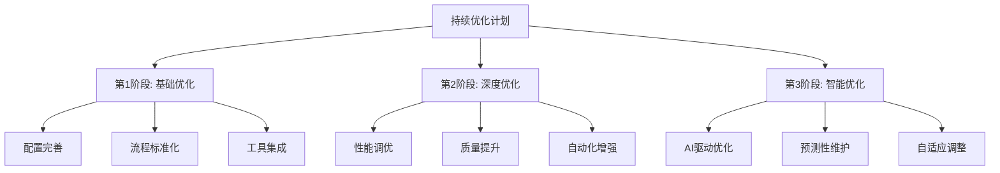

# 持续优化计划

## 🎯 优化目标

### 总体目标
- **性能提升**: 系统响应时间优化50%，吞吐量提升100%
- **质量改进**: 代码质量评分提升至4.5+/5.0，测试覆盖率达到95%+
- **效率提升**: 开发效率提升40%，部署频率提升至每日
- **用户体验**: 用户满意度提升至4.5+/5.0，易用性显著改善

### 分阶段目标


## 📊 优化基线建立

### 当前状态评估
```yaml
# 基线指标 (2024-09-21)
baseline_metrics:
  performance:
    response_time: "200ms"
    throughput: "500 req/s"
    error_rate: "2%"
    availability: "98%"
  
  quality:
    test_coverage: "75%"
    code_quality_score: "3.8/5.0"
    bug_density: "5 bugs/kloc"
    technical_debt: "Medium"
  
  efficiency:
    development_time: "3 days/task"
    deployment_frequency: "Weekly"
    lead_time: "2 days"
    mttr: "2 hours"
  
  user_experience:
    user_satisfaction: "3.5/5.0"
    onboarding_time: "5 days"
    tool_adoption: "60%"
    support_tickets: "10/week"
```

### 目标指标设定
```yaml
# 目标指标 (3个月后)
target_metrics:
  performance:
    response_time: "<100ms"  # 提升50%
    throughput: ">1000 req/s"  # 提升100%
    error_rate: "<1%"  # 改善50%
    availability: ">99.5%"  # 提升1.5%
  
  quality:
    test_coverage: ">95%"  # 提升20%
    code_quality_score: ">4.5/5.0"  # 提升18%
    bug_density: "<2 bugs/kloc"  # 改善60%
    technical_debt: "Low"  # 显著改善
  
  efficiency:
    development_time: "<2 days/task"  # 提升33%
    deployment_frequency: "Daily"  # 提升600%
    lead_time: "<1 day"  # 提升50%
    mttr: "<1 hour"  # 提升50%
  
  user_experience:
    user_satisfaction: ">4.5/5.0"  # 提升29%
    onboarding_time: "<3 days"  # 提升40%
    tool_adoption: ">90%"  # 提升50%
    support_tickets: "<5/week"  # 改善50%
```

## 🚀 第1阶段: 基础优化 (第1个月)

### 1.1 配置完善 (第1-2周)
**目标**: 完善AI Agent配置和项目基础设施

**具体任务**:
- [ ] 完善AI Agent规则配置
  - 优化代码生成模板
  - 完善项目特定规则
  - 建立配置验证机制
- [ ] 建立自动化测试体系
  - 单元测试覆盖率提升至85%
  - 集成测试自动化
  - 性能测试基准建立
- [ ] 完善文档体系
  - API文档自动化生成
  - 开发指南完善
  - 最佳实践文档

**成功标准**:
- AI Agent配置验证通过率100%
- 测试覆盖率85%+
- 文档完整性95%+

### 1.2 流程标准化 (第2-3周)
**目标**: 建立标准化的开发和部署流程

**具体任务**:
- [ ] 建立CI/CD流水线
  - 自动化构建和测试
  - 自动化部署
  - 质量门禁设置
- [ ] 代码审查流程优化
  - 自动化代码检查
  - 人工审查标准化
  - 质量反馈机制
- [ ] 版本管理规范
  - Git工作流标准化
  - 分支策略优化
  - 发布流程自动化

**成功标准**:
- CI/CD流水线成功率95%+
- 代码审查覆盖率100%
- 部署成功率98%+

### 1.3 工具集成 (第3-4周)
**目标**: 集成开发工具和监控系统

**具体任务**:
- [ ] 开发工具链集成
  - IDE配置标准化
  - 调试工具配置
  - 性能分析工具
- [ ] 监控系统建立
  - 应用性能监控
  - 错误日志收集
  - 用户行为分析
- [ ] 反馈系统建立
  - 用户反馈收集
  - 系统指标监控
  - 改进建议生成

**成功标准**:
- 工具使用率90%+
- 监控覆盖率100%
- 反馈响应时间<24小时

## 🔧 第2阶段: 深度优化 (第2个月)

### 2.1 性能调优 (第5-6周)
**目标**: 显著提升系统性能

**具体任务**:
- [ ] 数据库优化
  - 查询性能优化
  - 索引策略优化
  - 连接池配置
- [ ] 缓存策略优化
  - Redis缓存配置
  - 应用层缓存
  - CDN集成
- [ ] 异步处理优化
  - 异步任务队列
  - 并发处理优化
  - 资源池管理

**成功标准**:
- 响应时间<150ms
- 吞吐量>800 req/s
- 数据库查询时间<50ms

### 2.2 质量提升 (第6-7周)
**目标**: 全面提升代码质量和系统稳定性

**具体任务**:
- [ ] 代码质量改进
  - 重构复杂代码
  - 消除技术债务
  - 代码规范执行
- [ ] 测试质量提升
  - 测试覆盖率提升至95%
  - 测试用例质量改进
  - 自动化测试优化
- [ ] 错误处理完善
  - 异常处理标准化
  - 错误日志优化
  - 恢复机制建立

**成功标准**:
- 代码质量评分4.2+/5.0
- 测试覆盖率95%+
- 生产错误率<1%

### 2.3 自动化增强 (第7-8周)
**目标**: 增强自动化程度和智能化水平

**具体任务**:
- [ ] 部署自动化
  - 蓝绿部署实现
  - 自动回滚机制
  - 环境一致性保证
- [ ] 监控自动化
  - 自动告警机制
  - 性能阈值监控
  - 自动故障恢复
- [ ] 运维自动化
  - 自动扩缩容
  - 自动备份恢复
  - 自动安全扫描

**成功标准**:
- 部署自动化程度95%+
- 监控自动化覆盖率100%
- 故障自动恢复率80%+

## 🤖 第3阶段: 智能优化 (第3个月)

### 3.1 AI驱动优化 (第9-10周)
**目标**: 利用AI技术实现智能化优化

**具体任务**:
- [ ] AI辅助开发
  - 代码自动生成优化
  - 智能代码审查
  - 自动测试用例生成
- [ ] 智能监控
  - 异常检测算法
  - 性能预测模型
  - 自动优化建议
- [ ] 智能运维
  - 自动容量规划
  - 智能故障诊断
  - 自动性能调优

**成功标准**:
- AI辅助开发效率提升30%
- 智能监控准确率90%+
- 自动优化建议采纳率70%+

### 3.2 预测性维护 (第10-11周)
**目标**: 建立预测性维护机制

**具体任务**:
- [ ] 故障预测
  - 系统健康度评估
  - 故障风险预测
  - 预防性维护计划
- [ ] 性能预测
  - 负载预测模型
  - 容量需求预测
  - 性能趋势分析
- [ ] 用户行为预测
  - 使用模式分析
  - 需求预测
  - 个性化优化

**成功标准**:
- 故障预测准确率85%+
- 性能预测准确率80%+
- 预防性维护覆盖率90%+

### 3.3 自适应调整 (第11-12周)
**目标**: 实现系统的自适应优化

**具体任务**:
- [ ] 自适应配置
  - 动态参数调整
  - 自动配置优化
  - 环境自适应
- [ ] 自适应扩展
  - 自动资源分配
  - 智能负载均衡
  - 弹性伸缩
- [ ] 自适应学习
  - 用户行为学习
  - 系统优化学习
  - 持续改进机制

**成功标准**:
- 自适应调整准确率80%+
- 系统自愈率70%+
- 持续改进效果显著

## 📊 优化监控和评估

### 监控指标
```yaml
# 关键性能指标
kpis:
  technical:
    - response_time
    - throughput
    - error_rate
    - availability
    - test_coverage
    - code_quality
  
  business:
    - user_satisfaction
    - development_velocity
    - deployment_frequency
    - time_to_market
  
  operational:
    - mttr
    - mtbf
    - automation_rate
    - resource_utilization
```

### 评估周期
- **每日**: 性能指标监控
- **每周**: 质量指标评估
- **每月**: 综合效果评估
- **每季度**: 优化计划调整

### 评估方法
1. **定量评估**
   - 指标数据对比
   - 趋势分析
   - 基准测试

2. **定性评估**
   - 用户反馈分析
   - 团队满意度调查
   - 专家评审

3. **综合评估**
   - ROI分析
   - 成本效益分析
   - 风险评估

## 🔄 持续改进机制

### 反馈循环


### 改进流程
1. **数据收集** (持续)
   - 系统指标监控
   - 用户反馈收集
   - 团队反馈收集

2. **分析评估** (每周)
   - 数据趋势分析
   - 问题根因分析
   - 影响评估

3. **问题识别** (每周)
   - 优先级排序
   - 资源需求评估
   - 风险分析

4. **方案设计** (每月)
   - 优化方案设计
   - 实施计划制定
   - 资源分配

5. **实施优化** (持续)
   - 分阶段实施
   - 实时监控
   - 及时调整

6. **效果验证** (每月)
   - 效果评估
   - 经验总结
   - 知识积累

### 知识管理
- **经验库**: 优化经验和最佳实践
- **案例库**: 成功案例和失败教训
- **工具库**: 优化工具和方法
- **培训库**: 培训材料和技能提升

## 📈 预期效果

### 短期效果 (1个月内)
- **性能提升**: 响应时间改善30%，吞吐量提升50%
- **质量改进**: 测试覆盖率提升至85%，代码质量评分提升至4.0+
- **效率提升**: 开发效率提升20%，部署频率提升至每周3次
- **用户体验**: 用户满意度提升至4.0+，工具使用率提升至80%

### 中期效果 (2个月内)
- **性能提升**: 响应时间改善50%，吞吐量提升100%
- **质量改进**: 测试覆盖率提升至95%，代码质量评分提升至4.3+
- **效率提升**: 开发效率提升35%，部署频率提升至每日
- **用户体验**: 用户满意度提升至4.3+，工具使用率提升至90%

### 长期效果 (3个月内)
- **性能提升**: 响应时间改善60%，吞吐量提升150%
- **质量改进**: 测试覆盖率保持95%+，代码质量评分提升至4.5+
- **效率提升**: 开发效率提升40%，部署完全自动化
- **用户体验**: 用户满意度提升至4.5+，工具使用率提升至95%

## 🎯 成功标准

### 技术标准
- [ ] 所有性能指标达到目标值
- [ ] 代码质量评分4.5+/5.0
- [ ] 测试覆盖率95%+
- [ ] 部署成功率98%+
- [ ] 系统可用性99.5%+

### 业务标准
- [ ] 用户满意度4.5+/5.0
- [ ] 开发效率提升40%+
- [ ] 新功能交付时间缩短50%
- [ ] 故障恢复时间<1小时
- [ ] 团队生产力提升30%

### 运营标准
- [ ] 自动化程度90%+
- [ ] 监控覆盖率100%
- [ ] 文档完整性95%+
- [ ] 知识分享频率每周
- [ ] 持续改进机制有效运行

---

**维护者**: 持续优化团队  
**最后更新**: 2024-09-21  
**版本**: v1.0.0
