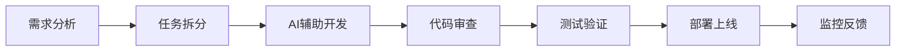

# 新成员上手指南

## 🎯 欢迎加入Firecrawl数据采集器团队！

本指南将帮助您在3天内快速上手项目开发，成为一名高效的团队成员。

## 📋 上手指南概览

### 第1天：环境搭建和项目理解 (4小时)
- [ ] 开发环境配置
- [ ] 项目结构学习
- [ ] AI Agent配置体验
- [ ] 基础功能测试

### 第2天：代码实践和工具使用 (6小时)
- [ ] 代码规范学习
- [ ] 第一个功能开发
- [ ] 测试用例编写
- [ ] 代码审查体验

### 第3天：团队协作和最佳实践 (4小时)
- [ ] 团队协作流程
- [ ] 部署和监控
- [ ] 知识分享参与
- [ ] 独立任务挑战

## 🚀 第1天：环境搭建

### 环境准备 (60分钟)

#### 1. 系统要求
```bash
# 操作系统支持
- macOS 10.15+
- Ubuntu 18.04+
- Windows 10+ (WSL2推荐)

# 必需软件
- Python 3.9+
- Docker & Docker Compose
- Git 2.20+
- VS Code + Cursor
```

#### 2. 开发环境安装
```bash
# 1. 克隆项目
git clone <repository-url>
cd Firecrawl数据采集器

# 2. 创建Python虚拟环境
python -m venv venv
source venv/bin/activate  # Linux/Mac
# 或 venv\Scripts\activate  # Windows

# 3. 安装依赖
pip install -r requirements.txt

# 4. 配置环境变量
cp .env.example .env
# 编辑.env文件，填入必要的配置信息
```

#### 3. 验证安装
```bash
# 运行测试验证环境
pytest tests/ -v

# 启动开发服务器
python -m uvicorn src.api_server:app --reload

# 访问API文档
open http://localhost:8000/docs
```

### 项目结构学习 (90分钟)

#### 1. 核心目录结构
```
Firecrawl数据采集器/
├── src/                    # 核心源代码
│   ├── firecrawl_collector.py    # 数据采集器
│   ├── data_processor.py         # 数据处理器
│   ├── api_server.py            # API服务器
│   └── ...
├── tests/                  # 测试文件
├── config/                 # 配置文件
├── docs/                   # 文档
└── .cursor/               # AI Agent配置
```

#### 2. 关键文件说明
- **README.md**: 项目概述和快速开始
- **project_status.md**: 项目当前状态和进度
- **requirements.txt**: Python依赖包列表
- **config.json**: 主配置文件
- **.cursor/rules/**: AI Agent规则配置

#### 3. 阅读建议顺序
1. `README.md` - 了解项目整体情况
2. `project_status.md` - 了解当前开发状态
3. `.cursor/rules/main.md` - 了解AI Agent配置
4. `src/firecrawl_collector.py` - 了解核心功能

### AI Agent配置体验 (60分钟)

#### 1. 配置验证
```bash
# 检查.cursor配置是否正确加载
ls -la .cursor/rules/

# 验证配置文件完整性
cat .cursor/agent-config.json | jq '.version'
```

#### 2. AI Agent测试
```bash
# 测试指令1：项目理解
# 在Cursor中输入：请分析当前项目的技术架构和主要功能模块

# 测试指令2：代码生成
# 在Cursor中输入：请为项目创建一个简单的健康检查工具类

# 测试指令3：问题解决
# 在Cursor中输入：当前项目的测试覆盖率如何？如何改进？
```

#### 3. 配置优化
- 根据个人习惯调整AI Agent响应风格
- 熟悉代码模板和最佳实践
- 了解自动生成的代码结构

### 基础功能测试 (30分钟)

#### 1. 数据采集测试
```bash
# 运行基础采集测试
python tests/integration_test.py

# 查看测试结果
cat results/test_report.json
```

#### 2. API接口测试
```bash
# 测试健康检查接口
curl http://localhost:8000/health

# 测试数据采集接口
curl -X POST "http://localhost:8000/api/v1/collect" \
  -H "Content-Type: application/json" \
  -d '{"url": "https://example.com"}'
```

## 🛠️ 第2天：代码实践

### 代码规范学习 (90分钟)

#### 1. Python编码规范
```python
# 命名规范示例
# 变量和函数：snake_case
user_name = "john_doe"
def collect_data(url: str) -> Dict[str, Any]:
    pass

# 类：PascalCase
class DataCollector:
    pass

# 常量：UPPER_SNAKE_CASE
API_BASE_URL = "https://api.firecrawl.dev"
MAX_RETRIES = 3
```

#### 2. 类型提示规范
```python
from typing import Dict, List, Optional, Any
from datetime import datetime

def process_data(
    data: Dict[str, Any],
    options: Optional[Dict[str, Any]] = None
) -> List[Dict[str, Any]]:
    """处理数据
    
    Args:
        data: 输入数据
        options: 处理选项
        
    Returns:
        处理后的数据列表
    """
    pass
```

#### 3. 文档字符串规范
```python
class DataProcessor:
    """数据处理器类
    
    负责数据的清洗、验证和转换处理
    """
    
    def __init__(self, config: Dict[str, Any]):
        """初始化数据处理器
        
        Args:
            config: 配置字典，包含处理参数
        """
        pass
```

### 第一个功能开发 (120分钟)

#### 1. 任务选择
选择以下简单任务之一：
- 添加URL验证功能
- 实现简单的日志工具
- 创建配置验证器
- 添加数据格式化工具

#### 2. 开发步骤
```bash
# 1. 创建功能分支
git checkout -b feature/your-feature-name

# 2. 使用AI Agent辅助开发
# 在Cursor中描述需求，让AI生成代码框架

# 3. 编写测试用例
# 先写测试，再写实现（TDD方式）

# 4. 实现功能代码
# 遵循项目规范和最佳实践

# 5. 运行测试验证
pytest tests/ -v
```

#### 3. AI Agent辅助示例
```markdown
# 在Cursor中输入：
请为项目创建一个URL验证工具类，包含以下功能：
1. 验证URL格式是否正确
2. 检查URL是否可访问
3. 提取URL的域名和路径信息
4. 支持HTTPS和HTTP协议

要求：
- 使用类型提示
- 添加完整的文档字符串
- 包含错误处理
- 编写对应的测试用例
```

### 测试用例编写 (60分钟)

#### 1. 测试框架使用
```python
import pytest
from unittest.mock import Mock, patch
from src.utils.url_validator import URLValidator

class TestURLValidator:
    """URL验证器测试类"""
    
    @pytest.fixture
    def validator(self):
        """创建测试用的验证器实例"""
        return URLValidator()
    
    def test_valid_url_format(self, validator):
        """测试有效URL格式"""
        assert validator.is_valid_format("https://example.com") is True
        assert validator.is_valid_format("http://example.com/path") is True
    
    def test_invalid_url_format(self, validator):
        """测试无效URL格式"""
        assert validator.is_valid_format("invalid-url") is False
        assert validator.is_valid_format("") is False
    
    @pytest.mark.asyncio
    async def test_url_accessibility(self, validator):
        """测试URL可访问性"""
        with patch('requests.get') as mock_get:
            mock_get.return_value.status_code = 200
            result = await validator.check_accessibility("https://example.com")
            assert result is True
```

#### 2. 测试运行
```bash
# 运行特定测试
pytest tests/test_url_validator.py -v

# 运行所有测试
pytest tests/ -v

# 生成覆盖率报告
pytest tests/ --cov=src --cov-report=html
```

### 代码审查体验 (30分钟)

#### 1. 创建Pull Request
```bash
# 提交代码
git add .
git commit -m "feat: add URL validation utility"
git push origin feature/your-feature-name

# 在GitHub创建Pull Request
# 标题：feat: add URL validation utility
# 描述：添加URL验证工具类，支持格式验证和可访问性检查
```

#### 2. 代码审查要点
- [ ] 代码符合项目规范
- [ ] 类型提示完整
- [ ] 文档字符串详细
- [ ] 测试用例覆盖
- [ ] 错误处理完善

## 👥 第3天：团队协作

### 团队协作流程 (90分钟)

#### 1. 日常开发流程


#### 2. 沟通渠道
- **技术讨论**: GitHub Issues & Discussions
- **日常沟通**: 团队群聊
- **知识分享**: 每周技术分享会
- **问题反馈**: 项目反馈系统

#### 3. 协作工具
- **代码管理**: Git + GitHub
- **项目管理**: GitHub Projects
- **文档协作**: Markdown + GitHub Wiki
- **AI辅助**: Cursor + 项目规则配置

### 部署和监控 (60分钟)

#### 1. 本地部署
```bash
# 使用Docker Compose启动完整环境
docker-compose -f config/deployment/docker-compose.yml up -d

# 查看服务状态
docker-compose ps

# 查看日志
docker-compose logs -f app
```

#### 2. 监控系统
```bash
# 访问监控面板
open http://localhost:3000  # Grafana
open http://localhost:9090  # Prometheus

# 查看API文档
open http://localhost:8000/docs

# 健康检查
curl http://localhost:8000/health
```

#### 3. 日志查看
```bash
# 应用日志
tail -f logs/app/app.log

# 错误日志
grep "ERROR" logs/app/app.log

# 性能日志
grep "PERFORMANCE" logs/app/app.log
```

### 知识分享参与 (60分钟)

#### 1. 学习资源
- **官方文档**: `docs/official-docs/`
- **最佳实践**: `docs/best-practices/`
- **API文档**: `http://localhost:8000/docs`
- **代码示例**: `src/` 目录下的现有代码

#### 2. 分享方式
- **代码审查**: 参与同事的代码审查
- **技术讨论**: 在Issues中讨论技术问题
- **经验分享**: 在团队会议中分享学习心得
- **文档贡献**: 改进和完善项目文档

#### 3. 持续学习
```bash
# 定期更新知识
git pull origin main

# 关注项目更新
git log --oneline -10

# 学习新技术
# 阅读技术博客和文档
# 参与开源项目
```

### 独立任务挑战 (90分钟)

#### 1. 挑战任务
选择一个中等难度的功能开发任务：
- 实现数据缓存机制
- 添加API限流功能
- 创建数据导出工具
- 优化数据库查询性能

#### 2. 完成标准
- [ ] 功能完整实现
- [ ] 测试用例覆盖 >90%
- [ ] 代码审查通过
- [ ] 文档更新完整
- [ ] 部署验证成功

#### 3. 评估标准
- **技术能力**: 代码质量和实现效率
- **协作能力**: 沟通和问题解决
- **学习能力**: 新技术掌握和适应
- **责任心**: 任务完成质量和时间管理

## ✅ 上手完成检查清单

### 技术能力检查
- [ ] 能够独立配置开发环境
- [ ] 理解项目架构和代码结构
- [ ] 掌握Python开发规范和最佳实践
- [ ] 能够使用AI Agent辅助开发
- [ ] 能够编写高质量的测试用例
- [ ] 能够进行代码审查和问题修复

### 协作能力检查
- [ ] 熟悉Git工作流和分支管理
- [ ] 能够参与团队沟通和讨论
- [ ] 理解项目部署和监控流程
- [ ] 能够独立完成功能开发任务
- [ ] 具备问题分析和解决能力
- [ ] 能够参与知识分享和学习

### 项目理解检查
- [ ] 了解Firecrawl数据采集器的核心功能
- [ ] 理解项目的技术栈和架构设计
- [ ] 掌握项目的开发流程和质量标准
- [ ] 熟悉项目的配置管理和部署方式
- [ ] 了解项目的监控和运维要求
- [ ] 能够独立分析和解决项目问题

## 🎯 后续发展建议

### 短期目标 (1个月内)
1. **技能提升**
   - 深入学习FastAPI和异步编程
   - 掌握数据库设计和优化
   - 熟悉容器化和部署技术

2. **项目贡献**
   - 完成3-5个功能开发任务
   - 参与5-10个代码审查
   - 贡献2-3个技术改进建议

### 中期目标 (3个月内)
1. **技术专长**
   - 成为某个技术领域的专家
   - 能够设计复杂的系统架构
   - 具备性能优化和安全加固能力

2. **团队贡献**
   - 指导新成员上手
   - 组织技术分享
   - 推动流程优化

### 长期目标 (6个月内)
1. **领导能力**
   - 能够独立负责大型功能模块
   - 具备技术决策能力
   - 能够推动技术演进

2. **创新贡献**
   - 引入新技术和工具
   - 优化开发流程
   - 提升团队效率

## 📞 支持和帮助

### 遇到问题时的求助渠道
1. **技术问题**: 在GitHub Issues中提问
2. **流程问题**: 咨询团队成员
3. **环境问题**: 查看文档或寻求技术支持
4. **学习问题**: 参与团队学习分享

### 常用资源链接
- **项目仓库**: [GitHub Repository]
- **API文档**: [API Documentation]
- **部署指南**: [Deployment Guide]
- **故障排除**: [Troubleshooting Guide]

### 联系方式
- **项目负责人**: [联系方式]
- **技术导师**: [联系方式]
- **团队群聊**: [群聊链接]

---

**欢迎加入我们的团队！** 🎉

如果您在上手过程中遇到任何问题，请随时寻求帮助。我们相信通过这个指南，您将能够快速融入团队，并为项目做出重要贡献。

---

**文档版本**: v1.0.0  
**最后更新**: 2024-09-21  
**维护者**: AI全栈工程师团队
