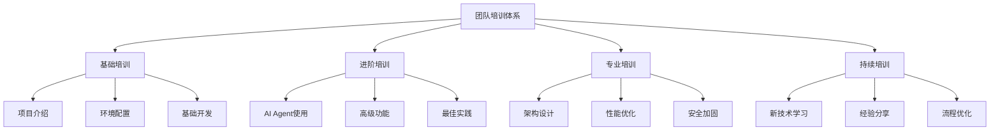

# 团队培训计划

## 🎯 培训目标

### 总体目标
- **快速上手**: 新团队成员3天内掌握项目开发流程
- **统一标准**: 所有成员使用相同的AI Agent配置和开发规范
- **高效协作**: 建立高效的团队协作机制和知识分享体系
- **持续改进**: 基于反馈持续优化培训内容和方式

### 具体目标
- **技术能力**: 掌握Firecrawl数据采集器项目的技术栈和架构
- **工具使用**: 熟练使用AI Agent辅助开发工具
- **流程规范**: 遵循统一的开发流程和质量标准
- **协作能力**: 具备高效的团队协作和沟通能力

## 📚 培训体系结构

### 培训层级


## 🗓️ 培训时间安排

### 新成员培训 (3天)
| 时间          | 培训内容               | 培训方式  | 负责人   | 评估方式 |
| ------------- | ---------------------- | --------- | -------- | -------- |
| **第1天上午** | 项目介绍和环境配置     | 理论+实践 | 技术导师 | 环境验证 |
| **第1天下午** | 代码规范和AI Agent使用 | 演示+练习 | 资深开发 | 代码审查 |
| **第2天上午** | 核心功能开发实践       | 项目实战  | 项目经理 | 功能实现 |
| **第2天下午** | 测试和部署流程         | 实际操作  | DevOps   | 部署验证 |
| **第3天上午** | 团队协作和沟通         | 模拟演练  | 团队Lead | 协作评估 |
| **第3天下午** | 综合考核和反馈         | 综合测试  | 全员参与 | 综合评分 |

### 定期培训 (每周)
| 时间     | 培训内容       | 时长   | 参与人员 |
| -------- | -------------- | ------ | -------- |
| **周一** | 技术分享会     | 1小时  | 全体开发 |
| **周三** | 最佳实践分享   | 30分钟 | 全体成员 |
| **周五** | 项目回顾和改进 | 45分钟 | 全体成员 |

### 专项培训 (每月)
| 时间      | 培训内容     | 培训方式  | 目标人群 |
| --------- | ------------ | --------- | -------- |
| **第1周** | 新技术栈学习 | 在线课程  | 全体成员 |
| **第2周** | 架构设计培训 | 工作坊    | 资深开发 |
| **第3周** | 性能优化培训 | 实战演练  | 全体开发 |
| **第4周** | 安全培训     | 讲座+练习 | 全体成员 |

## 📖 培训内容详述

### 1. 基础培训模块

#### 1.1 项目介绍 (2小时)
**目标**: 让新成员全面了解项目
**内容**:
- 项目背景和业务价值
- 技术架构和核心功能
- 开发规范和代码标准
- 团队组织和工作流程

**培训材料**:
- [项目README](README.md)
- [项目状态文档](project_status.md)
- [技术架构图](docs/architecture/)
- [开发规范](.cursor/rules/)

**评估方式**:
- 项目理解测试 (20题)
- 技术架构问答 (10题)
- 开发规范检查 (5题)

#### 1.2 环境配置 (3小时)
**目标**: 快速搭建开发环境
**内容**:
- 开发环境安装和配置
- AI Agent配置和使用
- 项目依赖安装和验证
- 基础功能测试

**培训材料**:
- [环境配置指南](docs/team/onboarding/README.md)
- [AI Agent配置](.cursor/agent-config.json)
- [快速开始指南](README.md#快速开始)

**评估方式**:
- 环境搭建成功率
- 功能测试通过率
- 配置验证通过率

#### 1.3 基础开发 (4小时)
**目标**: 掌握基本开发技能
**内容**:
- Python开发规范和最佳实践
- FastAPI框架使用
- 数据库操作和ORM
- 异步编程和并发处理

**培训材料**:
- [开发指南](.cursor/rules/development-guide.md)
- [代码模板](.cursor/templates.py)
- [最佳实践](docs/best-practices/)

**评估方式**:
- 代码质量检查
- 功能实现测试
- 代码审查评分

### 2. 进阶培训模块

#### 2.1 AI Agent使用 (3小时)
**目标**: 熟练使用AI Agent辅助开发
**内容**:
- AI Agent配置和规则理解
- 代码生成和优化建议
- 问题诊断和解决方案
- 最佳实践和技巧分享

**培训材料**:
- [AI Agent规则](.cursor/rules/ai-assistant.md)
- [使用技巧](docs/ai-agent-tips.md)
- [案例分享](docs/case-studies/)

**评估方式**:
- AI Agent使用熟练度测试
- 代码生成质量评估
- 问题解决效率测试

#### 2.2 高级功能开发 (4小时)
**目标**: 掌握高级开发技能
**内容**:
- 复杂业务逻辑实现
- 性能优化技巧
- 错误处理和日志记录
- 测试用例编写

**培训材料**:
- [高级开发指南](docs/advanced-development/)
- [性能优化](docs/performance-optimization/)
- [测试策略](docs/testing-strategy/)

**评估方式**:
- 复杂功能实现
- 性能测试结果
- 测试覆盖率

#### 2.3 最佳实践 (2小时)
**目标**: 掌握行业最佳实践
**内容**:
- 代码质量和可维护性
- 安全编程实践
- 文档编写规范
- 版本控制和分支管理

**培训材料**:
- [最佳实践指南](docs/best-practices/)
- [安全编程](docs/security/)
- [文档规范](docs/documentation/)

**评估方式**:
- 代码质量评分
- 安全检查通过率
- 文档质量评估

### 3. 专业培训模块

#### 3.1 架构设计 (6小时)
**目标**: 掌握系统架构设计
**内容**:
- 微服务架构设计
- 数据库设计优化
- API设计规范
- 系统集成方案

**培训材料**:
- [架构设计文档](docs/architecture/)
- [API设计指南](docs/api-design/)
- [集成方案](docs/integration/)

**评估方式**:
- 架构设计评审
- API设计评估
- 集成方案验证

#### 3.2 性能优化 (4小时)
**目标**: 掌握性能优化技能
**内容**:
- 性能分析和监控
- 数据库优化
- 缓存策略
- 并发处理优化

**培训材料**:
- [性能优化指南](docs/performance/)
- [监控配置](config/monitoring/)
- [优化案例](docs/optimization-cases/)

**评估方式**:
- 性能测试结果
- 优化效果验证
- 监控指标改善

#### 3.3 安全加固 (3小时)
**目标**: 掌握安全编程实践
**内容**:
- 安全威胁识别
- 安全编码实践
- 数据保护措施
- 安全测试方法

**培训材料**:
- [安全编程指南](docs/security/)
- [威胁模型](docs/threat-modeling/)
- [安全测试](docs/security-testing/)

**评估方式**:
- 安全漏洞扫描
- 安全测试通过率
- 安全知识测试

## 🎓 培训方式

### 培训方法
1. **理论讲解** (30%)
   - 概念介绍和原理说明
   - 最佳实践和规范讲解
   - 案例分析和经验分享

2. **实践操作** (50%)
   - 动手实验和项目实战
   - 代码编写和调试
   - 工具使用和配置

3. **互动讨论** (20%)
   - 问题解答和经验分享
   - 团队协作和沟通
   - 反馈收集和改进建议

### 培训工具
- **在线平台**: Zoom/腾讯会议
- **文档系统**: GitHub Wiki/Notion
- **代码平台**: GitHub/GitLab
- **协作工具**: Slack/钉钉
- **评估系统**: 自建评估平台

## 📊 培训评估

### 评估体系
```yaml
# 培训评估标准
evaluation_criteria:
  knowledge_assessment:
    weight: 30%
    methods: ["笔试", "问答", "案例分析"]
    passing_score: 80
  
  practical_skills:
    weight: 40%
    methods: ["项目实战", "代码审查", "功能测试"]
    passing_score: 85
  
  collaboration_ability:
    weight: 20%
    methods: ["团队协作", "沟通表达", "问题解决"]
    passing_score: 75
  
  continuous_improvement:
    weight: 10%
    methods: ["学习态度", "反馈质量", "改进建议"]
    passing_score: 70
```

### 评估流程
1. **培训前评估**
   - 技能水平测试
   - 学习目标设定
   - 培训计划制定

2. **培训中评估**
   - 实时进度跟踪
   - 学习效果检查
   - 问题及时解决

3. **培训后评估**
   - 综合能力测试
   - 实际工作验证
   - 持续改进跟踪

## 🔄 培训改进

### 反馈收集
```python
# 培训反馈收集
class TrainingFeedback:
    """培训反馈"""
    
    def __init__(self):
        self.content_quality = 0  # 内容质量 (1-5)
        self.instructor_rating = 0  # 讲师评分 (1-5)
        self.practical_value = 0  # 实用价值 (1-5)
        self.time_allocation = 0  # 时间分配 (1-5)
        self.suggestions = ""  # 改进建议
    
    def calculate_overall_score(self) -> float:
        """计算总体评分"""
        return (self.content_quality + self.instructor_rating + 
                self.practical_value + self.time_allocation) / 4
```

### 改进机制
1. **即时改进**
   - 培训过程中实时调整
   - 根据学员反馈优化内容
   - 及时解决遇到的问题

2. **定期优化**
   - 每月培训效果分析
   - 季度培训计划调整
   - 年度培训体系升级

3. **持续创新**
   - 新技术培训内容更新
   - 培训方式创新
   - 培训工具升级

## 📈 培训效果跟踪

### 关键指标
```yaml
# 培训效果指标
training_metrics:
  completion_rate:
    target: ">95%"
    measurement: "培训完成率"
  
  satisfaction_score:
    target: ">4.0/5.0"
    measurement: "学员满意度"
  
  skill_improvement:
    target: ">20%"
    measurement: "技能提升幅度"
  
  productivity_gain:
    target: ">30%"
    measurement: "工作效率提升"
  
  retention_rate:
    target: ">90%"
    measurement: "知识保留率"
```

### 跟踪方法
1. **短期跟踪** (1个月内)
   - 培训后立即评估
   - 1周后技能验证
   - 1个月后工作表现

2. **中期跟踪** (3个月内)
   - 季度技能评估
   - 项目贡献分析
   - 团队协作效果

3. **长期跟踪** (6个月内)
   - 年度综合评估
   - 职业发展跟踪
   - 培训投资回报

## 🎯 培训资源

### 培训材料库
```
docs/team/training/
├── materials/           # 培训材料
│   ├── presentations/   # 演示文稿
│   ├── handouts/        # 讲义资料
│   ├── exercises/       # 练习题目
│   └── references/      # 参考资料
├── assessments/         # 评估工具
│   ├── tests/          # 测试题库
│   ├── rubrics/        # 评分标准
│   └── templates/      # 评估模板
└── resources/          # 学习资源
    ├── videos/         # 视频教程
    ├── tutorials/      # 教程文档
    └── tools/          # 培训工具
```

### 讲师资源
- **内部讲师**: 项目负责人、技术专家、资深开发
- **外部讲师**: 行业专家、技术顾问、培训师
- **在线资源**: 技术博客、视频教程、在线课程

### 培训环境
- **物理环境**: 培训室、会议室、实验室
- **虚拟环境**: 在线平台、远程协作工具
- **开发环境**: 统一的开发环境和工具链

---

**维护者**: 团队培训负责人  
**最后更新**: 2024-09-21  
**版本**: v1.0.0
