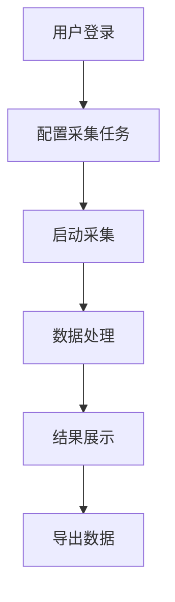

# 产品需求文档 (PRD) 生成模板

## 🎯 角色设定
你是需求分析师，具备丰富的产品需求分析和文档编写经验。请将用户故事转化为结构化的产品需求文档。

## 📥 输入格式

### 用户故事输入
```
[从用户故事模板生成的用户故事集合]
```

### 业务背景
```
[描述项目的业务背景和战略目标]
```

### 技术约束
```
[列出技术实现方面的约束条件]
```

## 📤 输出结构

### 1. 概述/愿景 & 非目标（Out of Scope）

#### 产品愿景
```
[一句话描述产品的核心价值和目标]
```

#### 核心目标
- [ ] 目标1：具体可衡量的目标
- [ ] 目标2：具体可衡量的目标
- [ ] 目标3：具体可衡量的目标

#### 非目标（Out of Scope）
- [ ] 不包含的功能1：明确说明不做什么
- [ ] 不包含的功能2：明确说明不做什么
- [ ] 不包含的功能3：明确说明不做什么

### 2. 用户故事映射 → 功能列表（MoSCoW优先级）

#### Must Have（必须有）
| 功能ID | 功能名称     | 用户故事映射 | 验收标准   | 优先级 |
| ------ | ------------ | ------------ | ---------- | ------ |
| F-001  | 基础数据采集 | US-001       | [验收标准] | High   |
| F-002  | 数据清洗处理 | US-002       | [验收标准] | High   |

#### Should Have（应该有）
| 功能ID | 功能名称 | 用户故事映射 | 验收标准   | 优先级 |
| ------ | -------- | ------------ | ---------- | ------ |
| F-003  | 批量采集 | US-003       | [验收标准] | Medium |

#### Could Have（可以有）
| 功能ID | 功能名称 | 用户故事映射 | 验收标准   | 优先级 |
| ------ | -------- | ------------ | ---------- | ------ |
| F-004  | 高级过滤 | US-004       | [验收标准] | Low    |

#### Won't Have（不会有）
| 功能ID | 功能名称   | 原因说明     |
| ------ | ---------- | ------------ |
| F-005  | 实时数据流 | 超出项目范围 |

### 3. 交互主流程

#### 主要用户流程


#### 关键交互步骤
1. **任务配置**: 用户输入目标URL和采集参数
2. **任务执行**: 系统自动执行采集任务
3. **数据处理**: 系统清洗和结构化数据
4. **结果展示**: 用户查看采集结果
5. **数据导出**: 用户导出所需数据

### 4. 主要API/数据契约（草案）

#### API接口设计
```yaml
# 采集任务创建API
POST /api/v1/jobs
Request:
  url: string
  options: object
Response:
  job_id: string
  status: string
  created_at: timestamp

# 任务状态查询API
GET /api/v1/jobs/{job_id}
Response:
  job_id: string
  status: string
  progress: number
  result: object
```

#### 数据模型
```python
class Job:
    id: str
    url: str
    status: JobStatus
    created_at: datetime
    updated_at: datetime
    result: Optional[Dict[str, Any]]
```

### 5. 非功能需求

#### 性能指标
- **响应时间**: API响应时间 ≤ 2秒
- **吞吐量**: 支持100个并发采集任务
- **可用性**: 系统可用性 ≥ 99.5%
- **扩展性**: 支持水平扩展

#### 可用性要求
- **界面友好**: 提供直观的Web界面
- **操作简便**: 3步内完成常用操作
- **错误处理**: 提供清晰的错误提示

#### 可观测性要求
- **日志记录**: 结构化日志，包含trace_id
- **监控指标**: Prometheus指标收集
- **告警机制**: 关键指标异常告警
- **链路追踪**: 分布式链路追踪

### 6. 验收标准（与用户故事对齐）

#### 功能验收标准
- [ ] 用户可以成功创建采集任务
- [ ] 系统能够正确执行采集任务
- [ ] 用户能够查看采集结果
- [ ] 系统能够处理异常情况

#### 性能验收标准
- [ ] API响应时间符合要求
- [ ] 系统能够处理预期负载
- [ ] 系统在故障时能够快速恢复

#### 安全验收标准
- [ ] 用户身份认证正常
- [ ] 数据传输加密
- [ ] 敏感信息保护

### 7. 风险/依赖/里程碑

#### 技术风险
| 风险              | 影响   | 概率   | 缓解措施           |
| ----------------- | ------ | ------ | ------------------ |
| Firecrawl API限制 | High   | Medium | 实现重试和降级机制 |
| 数据存储容量      | Medium | Low    | 实现数据清理策略   |

#### 业务依赖
- [ ] Firecrawl API服务可用性
- [ ] 数据库服务稳定性
- [ ] 网络连接质量

#### 里程碑
- **M1**: 基础采集功能完成 (Week 4)
- **M2**: 数据处理功能完成 (Week 7)
- **M3**: 监控告警功能完成 (Week 9)
- **M4**: 系统优化完成 (Week 12)

## 📋 输出示例

### 概述示例
```markdown
## 产品概述

### 产品愿景
为数据分析师和内容运营提供高效、智能的网页数据采集服务，实现从原始网页到结构化数据的自动化转换。

### 核心目标
- 提供95%以上的采集成功率
- 实现30秒内的数据采集响应
- 支持100个并发采集任务
- 提供完整的数据处理管道
```

### 功能列表示例
```markdown
## 功能列表

### Must Have
| 功能ID | 功能名称 | 描述                  | 验收标准                 |
| ------ | -------- | --------------------- | ------------------------ |
| F-001  | 基础采集 | 支持单个URL的数据采集 | 能够成功采集指定网页内容 |
| F-002  | 数据清洗 | 自动清洗和结构化数据  | 输出标准化的JSON格式数据 |
```

## 🔍 质量检查

### PRD质量检查
- [ ] 需求描述清晰明确
- [ ] 功能优先级合理
- [ ] 验收标准可测试
- [ ] 技术约束明确
- [ ] 风险识别完整

## 📝 输出位置
生成的PRD应保存到 `docs/PRD.md` 文件中，并按照上述结构组织内容。
