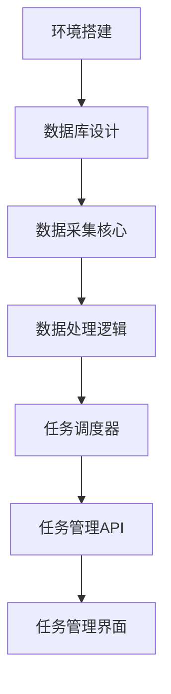

# 任务分解模板

## 🎯 角色设定
你是项目经理，具备丰富的项目管理和任务分解经验。请将PRD分解为可执行的任务，涵盖前端、后端、数据、DevOps、QA等各个方面。

## 📥 输入格式

### PRD输入
```
[从PRD模板生成的产品需求文档]
```

### 技术约束
```
[列出技术实现方面的约束条件]
```

### 团队配置
```
[描述团队规模和技能配置]
```

## 📤 输出格式

### 任务分解表格

| 任务ID | 任务名称         | 模块/目录   | 负责人角色 | 预计工时 | 依赖   | 优先级 | 验收标准             | 交付物路径            |
| ------ | ---------------- | ----------- | ---------- | -------- | ------ | ------ | -------------------- | --------------------- |
| TB-001 | 设计数据模型     | src/models/ | Backend    | 1d       | -      | High   | 完成数据模型设计文档 | src/models/job.py     |
| TB-002 | 实现采集核心逻辑 | src/core/   | Backend    | 3d       | TB-001 | High   | 通过单元测试         | src/core/collector.py |
| TB-003 | 开发API接口      | src/api/    | Backend    | 2d       | TB-002 | High   | API文档和测试通过    | src/api/routes.py     |

### 任务详细说明

#### TB-001: 设计数据模型
- **模块**: `src/models/`
- **负责人**: Backend Developer
- **预计工时**: 1天
- **依赖**: 无
- **优先级**: High
- **验收标准**: 
  - [ ] 完成Job、Task、Result等核心数据模型
  - [ ] 包含完整的字段定义和约束
  - [ ] 提供数据库迁移脚本
- **交付物路径**: `src/models/job.py`, `src/models/task.py`, `src/models/result.py`

#### TB-002: 实现采集核心逻辑
- **模块**: `src/core/`
- **负责人**: Backend Developer
- **预计工时**: 3天
- **依赖**: TB-001
- **优先级**: High
- **验收标准**:
  - [ ] 实现Firecrawl API集成
  - [ ] 支持错误处理和重试机制
  - [ ] 单元测试覆盖率≥80%
- **交付物路径**: `src/core/collector.py`, `tests/unit/test_collector.py`

## 🔧 任务分解原则

### 任务粒度
- **单个任务**: 1-3天完成
- **可测试**: 每个任务都有明确的验收标准
- **可交付**: 每个任务都有具体的交付物
- **独立性**: 任务之间依赖关系清晰

### 角色分工
- **Backend**: 后端逻辑、API开发、数据库设计
- **Frontend**: 用户界面、交互设计、前端逻辑
- **DevOps**: 部署脚本、监控配置、CI/CD
- **QA**: 测试用例、自动化测试、质量保证
- **Data**: 数据处理、ETL、数据质量

### 优先级定义
- **High**: 核心功能，必须完成
- **Medium**: 重要功能，优先完成
- **Low**: 可选功能，有时间再完成

## 📋 任务分类

### 1. 基础设施任务
| 任务ID | 任务名称     | 模块        | 工时 | 优先级 |
| ------ | ------------ | ----------- | ---- | ------ |
| TB-001 | 项目环境搭建 | -           | 0.5d | High   |
| TB-002 | 数据库设计   | src/models/ | 1d   | High   |
| TB-003 | CI/CD配置    | .github/    | 1d   | Medium |

### 2. 核心功能任务
| 任务ID | 任务名称     | 模块            | 工时 | 优先级 |
| ------ | ------------ | --------------- | ---- | ------ |
| TB-004 | 数据采集核心 | src/core/       | 3d   | High   |
| TB-005 | 数据处理逻辑 | src/processors/ | 2d   | High   |
| TB-006 | 任务调度器   | src/scheduler/  | 2d   | High   |

### 3. API接口任务
| 任务ID | 任务名称    | 模块     | 工时 | 优先级 |
| ------ | ----------- | -------- | ---- | ------ |
| TB-007 | 任务管理API | src/api/ | 2d   | High   |
| TB-008 | 数据查询API | src/api/ | 1d   | High   |
| TB-009 | 监控API     | src/api/ | 1d   | Medium |

### 4. 前端界面任务
| 任务ID | 任务名称     | 模块      | 工时 | 优先级 |
| ------ | ------------ | --------- | ---- | ------ |
| TB-010 | 任务管理界面 | frontend/ | 3d   | Medium |
| TB-011 | 数据展示界面 | frontend/ | 2d   | Medium |
| TB-012 | 监控仪表板   | frontend/ | 2d   | Low    |

### 5. 测试任务
| 任务ID | 任务名称   | 模块               | 工时 | 优先级 |
| ------ | ---------- | ------------------ | ---- | ------ |
| TB-013 | 单元测试   | tests/unit/        | 2d   | High   |
| TB-014 | 集成测试   | tests/integration/ | 1d   | High   |
| TB-015 | 端到端测试 | tests/e2e/         | 1d   | Medium |

### 6. 部署运维任务
| 任务ID | 任务名称   | 模块               | 工时 | 优先级 |
| ------ | ---------- | ------------------ | ---- | ------ |
| TB-016 | Docker配置 | config/            | 1d   | High   |
| TB-017 | 监控配置   | config/monitoring/ | 1d   | Medium |
| TB-018 | 文档编写   | docs/              | 1d   | Low    |

## 🔄 任务依赖关系

### 依赖图


### 关键路径
1. **TB-001 → TB-002 → TB-004 → TB-005 → TB-006 → TB-007**
2. **TB-004 → TB-013** (测试依赖)
3. **TB-007 → TB-014** (集成测试)

## 📊 工作量估算

### 总工作量统计
| 角色     | 任务数量 | 总工时  | 占比     |
| -------- | -------- | ------- | -------- |
| Backend  | 8        | 12d     | 50%      |
| Frontend | 3        | 7d      | 29%      |
| DevOps   | 3        | 3d      | 13%      |
| QA       | 3        | 4d      | 17%      |
| **总计** | **17**   | **26d** | **100%** |

### 里程碑计划
- **Week 1**: 基础设施 + 核心功能 (TB-001 ~ TB-006)
- **Week 2**: API接口 + 前端界面 (TB-007 ~ TB-012)
- **Week 3**: 测试 + 部署 (TB-013 ~ TB-018)

## 🔍 质量检查

### 任务分解质量检查
- [ ] 每个任务都有明确的负责人
- [ ] 任务粒度适中（1-3天）
- [ ] 依赖关系清晰
- [ ] 验收标准可测试
- [ ] 交付物路径明确

### 工作量估算检查
- [ ] 工时估算合理
- [ ] 角色分工均衡
- [ ] 关键路径识别
- [ ] 风险任务标记

## 📝 输出位置
生成的任务分解应保存到 `docs/TASKS.md` 文件中，并按照上述表格格式组织内容。
