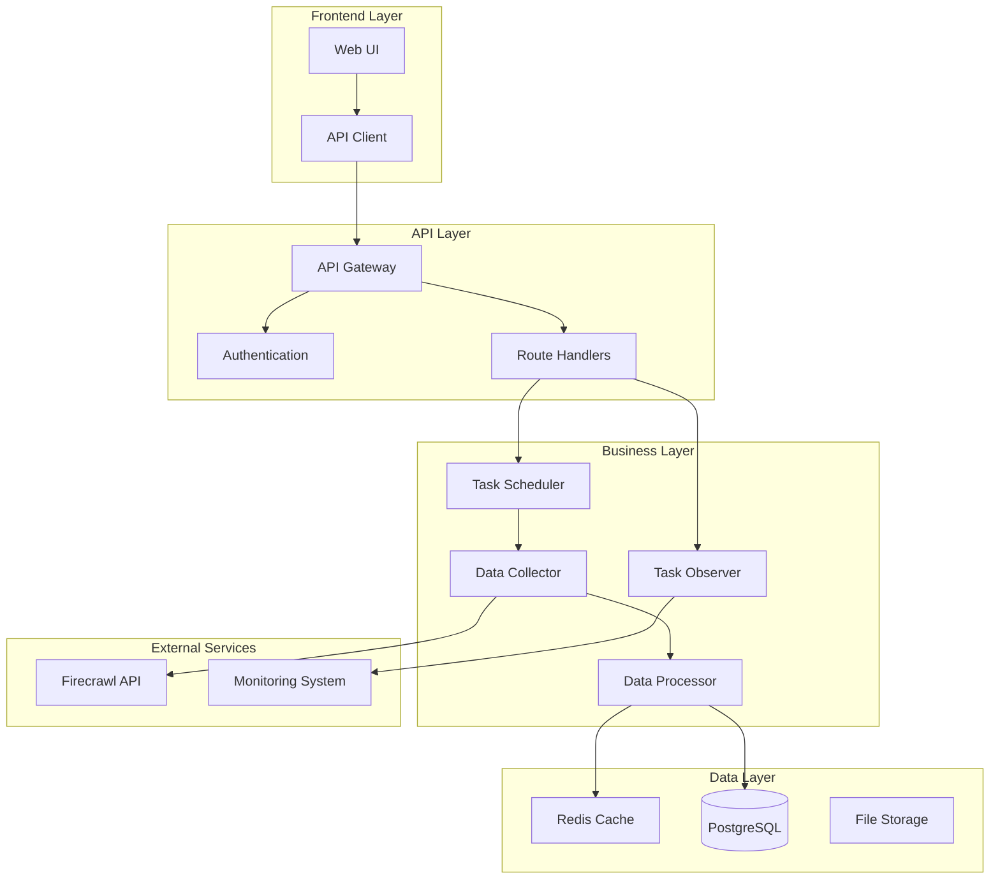
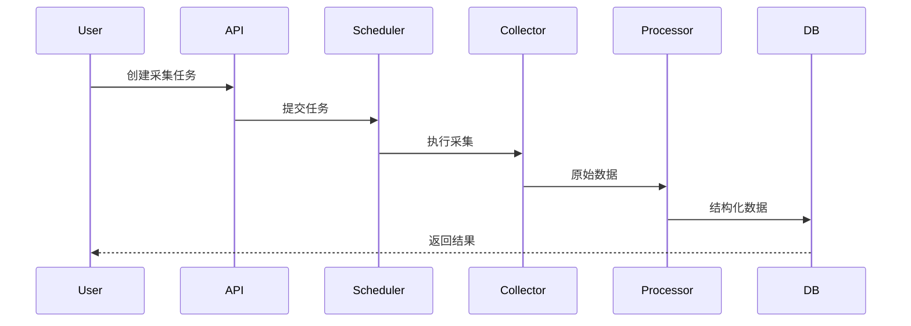

# 技术设计模板

## 🎯 角色设定
你是架构师，具备丰富的系统设计和架构经验。请产出技术方案，兼顾可实现性与可演进性。

## 📥 输入格式

### 任务分解输入
```
[从任务分解模板生成的任务列表]
```

### 技术约束
```
[列出技术实现方面的约束条件]
```

### 性能要求
```
[列出性能和扩展性要求]
```

## 📤 输出结构

### 1. 架构/模块图与职责边界

#### 系统架构图


#### 模块职责边界
| 模块           | 职责                    | 接口            | 依赖                |
| -------------- | ----------------------- | --------------- | ------------------- |
| API Gateway    | 请求路由、认证、限流    | HTTP REST API   | Auth, Routes        |
| Task Scheduler | 任务调度、队列管理      | Queue Interface | Collector, Observer |
| Data Collector | 数据采集、Firecrawl集成 | Firecrawl API   | Processor           |
| Data Processor | 数据清洗、结构化        | Data Pipeline   | Cache, DB           |
| Task Observer  | 任务监控、状态管理      | Event Interface | Monitoring          |

### 2. 数据流与接口设计

#### 数据流程图


#### 接口设计
```yaml
# 任务创建接口
POST /api/v1/jobs:
  request:
    url: string
    options:
      max_pages: integer
      timeout: integer
      retry_count: integer
  response:
    job_id: string
    status: string
    created_at: timestamp

# 任务状态查询接口
GET /api/v1/jobs/{job_id}:
  response:
    job_id: string
    status: enum[pending, running, completed, failed]
    progress: integer
    result: object
    error_message: string

# 数据查询接口
GET /api/v1/data:
  query:
    job_id: string
    page: integer
    limit: integer
  response:
    data: array
    total: integer
    page: integer
    limit: integer
```

#### 错误处理与重试策略
```python
class RetryConfig:
    max_retries: int = 3
    backoff_factor: float = 2.0
    max_backoff: int = 60
    retry_on_status: List[int] = [500, 502, 503, 504]

class ErrorHandler:
    def handle_firecrawl_error(self, error: FirecrawlError):
        if error.status_code in [429, 503]:
            # 限流或服务不可用，使用指数退避
            return self.retry_with_backoff()
        elif error.status_code == 404:
            # URL不存在，直接失败
            return self.fail_task()
        else:
            # 其他错误，重试
            return self.retry_task()
```

### 3. 关键算法/库选型与取舍理由

#### 核心技术选型
| 技术     | 选择       | 理由                       | 替代方案          | 取舍原因                        |
| -------- | ---------- | -------------------------- | ----------------- | ------------------------------- |
| Web框架  | FastAPI    | 高性能、自动文档、类型提示 | Flask, Django     | FastAPI性能更好，文档生成更完善 |
| 数据库   | PostgreSQL | 支持JSON、事务、扩展性好   | MySQL, MongoDB    | PostgreSQL对JSON支持更好        |
| 缓存     | Redis      | 高性能、支持多种数据结构   | Memcached         | Redis功能更丰富                 |
| 任务队列 | Celery     | 成熟稳定、功能完整         | RQ, Dramatiq      | Celery生态更完善                |
| 监控     | Prometheus | 指标收集、告警、可视化     | InfluxDB, DataDog | Prometheus开源且功能强大        |

#### 算法选择
```python
# 指数退避重试算法
class ExponentialBackoff:
    def __init__(self, base_delay: float = 1.0, max_delay: float = 60.0):
        self.base_delay = base_delay
        self.max_delay = max_delay
        self.attempt = 0
    
    def get_delay(self) -> float:
        delay = self.base_delay * (2 ** self.attempt)
        return min(delay, self.max_delay)
    
    def next_attempt(self):
        self.attempt += 1

# 数据清洗算法
class DataCleaner:
    def clean_html(self, html: str) -> str:
        # 使用BeautifulSoup清理HTML
        soup = BeautifulSoup(html, 'html.parser')
        return soup.get_text()
    
    def extract_structured_data(self, text: str) -> Dict:
        # 使用正则表达式提取结构化数据
        patterns = {
            'title': r'<title>(.*?)</title>',
            'description': r'<meta name="description" content="(.*?)">',
            'author': r'<meta name="author" content="(.*?)">'
        }
        return {key: re.search(pattern, text) for key, pattern in patterns.items()}
```

### 4. 可测试性设计

#### 依赖注入设计
```python
from abc import ABC, abstractmethod

class DataCollectorInterface(ABC):
    @abstractmethod
    async def collect(self, url: str) -> Dict[str, Any]:
        pass

class FirecrawlCollector(DataCollectorInterface):
    def __init__(self, api_key: str, timeout: int = 30):
        self.api_key = api_key
        self.timeout = timeout
    
    async def collect(self, url: str) -> Dict[str, Any]:
        # 实现Firecrawl采集逻辑
        pass

class MockCollector(DataCollectorInterface):
    async def collect(self, url: str) -> Dict[str, Any]:
        # 返回模拟数据用于测试
        return {"title": "Test Title", "content": "Test Content"}

# 使用依赖注入
class TaskProcessor:
    def __init__(self, collector: DataCollectorInterface):
        self.collector = collector
    
    async def process_task(self, url: str):
        data = await self.collector.collect(url)
        return self.process_data(data)
```

#### 接口隔离设计
```python
# 数据访问接口
class JobRepositoryInterface(ABC):
    @abstractmethod
    async def create_job(self, job_data: Dict) -> Job:
        pass
    
    @abstractmethod
    async def get_job(self, job_id: str) -> Optional[Job]:
        pass
    
    @abstractmethod
    async def update_job_status(self, job_id: str, status: JobStatus):
        pass

# 实现类
class PostgreSQLJobRepository(JobRepositoryInterface):
    def __init__(self, db_session):
        self.db_session = db_session
    
    async def create_job(self, job_data: Dict) -> Job:
        # 实现数据库操作
        pass
```

#### 契约测试设计
```python
# 契约测试
class TestFirecrawlAPIContract:
    def test_collect_endpoint_contract(self):
        # 测试Firecrawl API接口契约
        response = self.firecrawl_client.collect(url="https://example.com")
        
        # 验证响应结构
        assert "title" in response
        assert "content" in response
        assert "metadata" in response
        
        # 验证数据类型
        assert isinstance(response["title"], str)
        assert isinstance(response["content"], str)
        assert isinstance(response["metadata"], dict)
```

### 5. 观测性设计

#### 日志结构化设计
```python
import structlog
import uuid

logger = structlog.get_logger()

class TaskProcessor:
    def __init__(self):
        self.logger = logger.bind(component="task_processor")
    
    async def process_task(self, task_id: str, url: str):
        trace_id = str(uuid.uuid4())
        self.logger = self.logger.bind(trace_id=trace_id, task_id=task_id)
        
        self.logger.info("开始处理任务", url=url)
        
        try:
            result = await self.collect_data(url)
            self.logger.info("任务处理成功", result_size=len(str(result)))
            return result
        except Exception as e:
            self.logger.error("任务处理失败", error=str(e), exc_info=True)
            raise
```

#### 关键指标设计
```python
from prometheus_client import Counter, Histogram, Gauge

# 指标定义
job_counter = Counter('firecrawl_jobs_total', 'Total number of jobs', ['status'])
job_duration = Histogram('firecrawl_job_duration_seconds', 'Job processing duration')
active_jobs = Gauge('firecrawl_active_jobs', 'Number of active jobs')
api_requests = Counter('firecrawl_api_requests_total', 'API requests', ['endpoint', 'status'])

class MetricsCollector:
    def record_job_start(self, job_id: str):
        active_jobs.inc()
    
    def record_job_completion(self, job_id: str, status: str, duration: float):
        job_counter.labels(status=status).inc()
        job_duration.observe(duration)
        active_jobs.dec()
    
    def record_api_request(self, endpoint: str, status: int):
        api_requests.labels(endpoint=endpoint, status=str(status)).inc()
```

#### 链路追踪设计
```python
from opentelemetry import trace
from opentelemetry.instrumentation.fastapi import FastAPIInstrumentor

# 链路追踪配置
tracer = trace.get_tracer(__name__)

class TaskProcessor:
    async def process_task(self, task_id: str, url: str):
        with tracer.start_as_current_span("process_task") as span:
            span.set_attribute("task_id", task_id)
            span.set_attribute("url", url)
            
            # 采集数据
            with tracer.start_as_current_span("collect_data"):
                data = await self.collect_data(url)
            
            # 处理数据
            with tracer.start_as_current_span("process_data"):
                result = await self.process_data(data)
            
            span.set_attribute("result_size", len(str(result)))
            return result
```

### 6. 风险缓解策略

#### 降级策略
```python
class CircuitBreaker:
    def __init__(self, failure_threshold: int = 5, timeout: int = 60):
        self.failure_threshold = failure_threshold
        self.timeout = timeout
        self.failure_count = 0
        self.last_failure_time = None
        self.state = "CLOSED"  # CLOSED, OPEN, HALF_OPEN
    
    async def call(self, func, *args, **kwargs):
        if self.state == "OPEN":
            if time.time() - self.last_failure_time > self.timeout:
                self.state = "HALF_OPEN"
            else:
                raise CircuitBreakerOpenError()
        
        try:
            result = await func(*args, **kwargs)
            self.on_success()
            return result
        except Exception as e:
            self.on_failure()
            raise e
    
    def on_success(self):
        self.failure_count = 0
        self.state = "CLOSED"
    
    def on_failure(self):
        self.failure_count += 1
        self.last_failure_time = time.time()
        if self.failure_count >= self.failure_threshold:
            self.state = "OPEN"
```

#### 限流策略
```python
import asyncio
from collections import deque

class RateLimiter:
    def __init__(self, max_requests: int, time_window: int):
        self.max_requests = max_requests
        self.time_window = time_window
        self.requests = deque()
        self.lock = asyncio.Lock()
    
    async def acquire(self):
        async with self.lock:
            now = time.time()
            
            # 清理过期请求
            while self.requests and self.requests[0] <= now - self.time_window:
                self.requests.popleft()
            
            # 检查是否超过限制
            if len(self.requests) >= self.max_requests:
                sleep_time = self.requests[0] + self.time_window - now
                await asyncio.sleep(sleep_time)
                return await self.acquire()
            
            self.requests.append(now)
```

#### 幂等性设计
```python
class IdempotentTaskProcessor:
    def __init__(self, redis_client):
        self.redis_client = redis_client
    
    async def process_task(self, task_id: str, url: str):
        # 检查是否已经处理过
        cache_key = f"task_result:{task_id}"
        cached_result = await self.redis_client.get(cache_key)
        
        if cached_result:
            return json.loads(cached_result)
        
        # 处理任务
        result = await self._do_process_task(url)
        
        # 缓存结果
        await self.redis_client.setex(
            cache_key, 
            3600,  # 1小时过期
            json.dumps(result)
        )
        
        return result
```

## 🔍 质量检查

### 技术设计质量检查
- [ ] 架构图清晰，模块职责明确
- [ ] 数据流设计合理
- [ ] 接口设计完整
- [ ] 错误处理策略完善
- [ ] 可测试性设计充分
- [ ] 观测性设计完整
- [ ] 风险缓解策略有效

## 📝 输出位置
生成的技术设计文档应保存到 `docs/TECH_DESIGN.md` 文件中，并按照上述结构组织内容。
