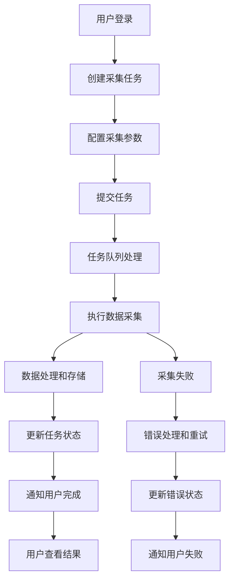
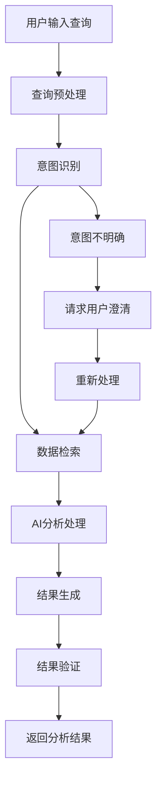
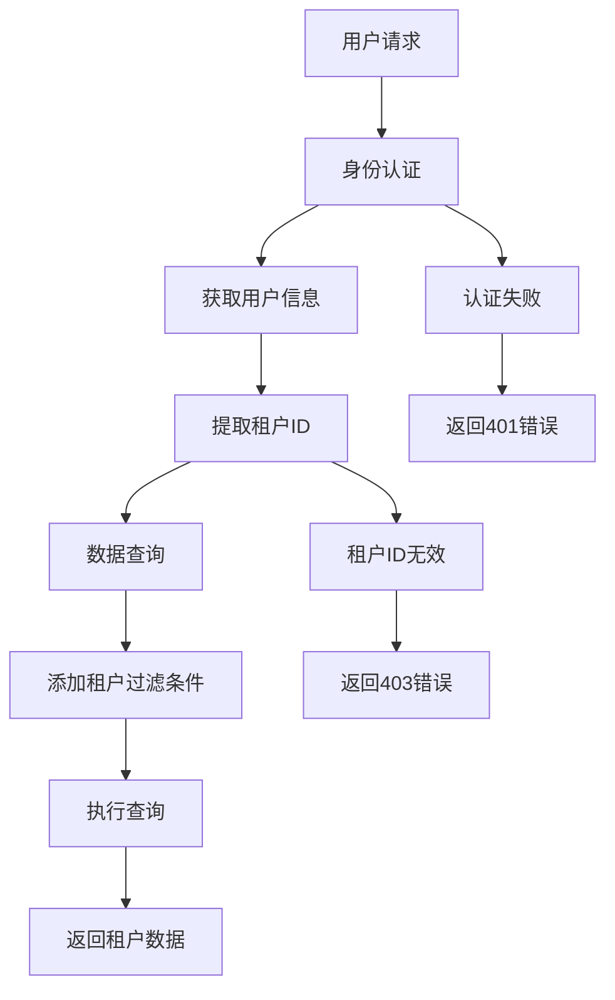

# PRD阶段提示词

## 【角色】
产品经理（PM）/需求分析师（BA）

## 【目标】
基于用户故事生成完整的产品需求文档，确保产品功能满足用户需求。

## 【输入】
- 用户故事（来自PM）
- 业务目标和约束
- 技术可行性评估
- 竞品分析结果

## 【输出】
- 愿景&非目标、MoSCoW 优先级
- 主流程/线框草图(文字/mermaid)
- 接口/数据契约草案与错误/超时/重试
- 非功能目标值
- 验收标准矩阵(故事↔验收用例 1:1)

## 【PRD文档结构】

### 1. 产品概述
```markdown
# 产品需求文档（PRD）

## 产品愿景
Firecrawl数据采集器是一个基于AI的现代化数据采集平台，为企业和个人用户提供智能、高效、安全的数据采集和分析服务。

## 产品目标
- 提供简单易用的数据采集工具
- 实现AI驱动的智能数据分析
- 支持多租户的企业级服务
- 确保数据安全和隐私保护

## 目标用户
- 数据分析师：需要采集和分析数据
- 企业用户：需要批量数据采集服务
- 开发者：需要API集成数据采集
- 研究人员：需要学术数据采集

## 非目标
- 不提供数据存储服务（仅提供采集和分析）
- 不支持实时数据流处理
- 不提供数据可视化工具
- 不提供数据清洗和预处理服务
```

### 2. 功能需求

#### 2.1 核心功能（Must Have）

##### 数据采集管理
```markdown
### 功能描述
提供完整的数据采集任务管理功能，支持多种数据源和采集方式。

### 功能特性
- 创建数据采集任务
- 监控采集进度
- 管理采集结果
- 设置采集参数

### 用户界面
- 任务列表页面
- 任务详情页面
- 任务创建向导
- 进度监控面板

### 技术实现
- RESTful API接口
- 异步任务处理
- 实时状态更新
- 错误处理和重试
```

##### AI智能分析
```markdown
### 功能描述
基于AI技术提供智能数据分析和查询功能。

### 功能特性
- 自然语言查询
- 数据自动分类
- 内容摘要生成
- 相似性搜索

### 用户界面
- AI查询界面
- 分析结果展示
- 分类管理页面
- 搜索历史记录

### 技术实现
- OpenAI API集成
- Pinecone向量数据库
- 自然语言处理
- 机器学习模型
```

#### 2.2 重要功能（Should Have）

##### 多租户管理
```markdown
### 功能描述
提供完整的多租户架构，支持企业级用户管理。

### 功能特性
- 租户数据隔离
- 用户权限管理
- 资源配额控制
- 团队协作功能

### 用户界面
- 租户管理页面
- 用户管理界面
- 权限设置页面
- 团队协作面板

### 技术实现
- 多租户数据架构
- 基于角色的权限控制
- 资源配额管理
- 团队协作API
```

##### 数据可视化
```markdown
### 功能描述
提供数据采集结果的可视化展示功能。

### 功能特性
- 数据图表展示
- 采集统计报告
- 趋势分析图表
- 导出功能

### 用户界面
- 数据仪表板
- 图表展示页面
- 报告生成界面
- 导出设置页面

### 技术实现
- 图表库集成
- 数据统计计算
- 报告生成引擎
- 多格式导出
```

#### 2.3 可选功能（Could Have）

##### 高级分析
```markdown
### 功能描述
提供高级数据分析功能，满足专业用户需求。

### 功能特性
- 自定义分析规则
- 数据关联分析
- 预测分析
- 异常检测

### 用户界面
- 分析规则配置
- 关联分析界面
- 预测结果展示
- 异常告警面板

### 技术实现
- 规则引擎
- 机器学习算法
- 统计分析库
- 告警系统
```

#### 2.4 暂不实现（Won't Have）

##### 实时数据流
- 不提供实时数据流处理
- 不提供流式数据分析
- 不提供实时告警功能

##### 数据存储服务
- 不提供长期数据存储
- 不提供数据备份服务
- 不提供数据恢复功能

## 【主流程设计】

### 1. 数据采集流程


### 2. AI分析流程


### 3. 多租户数据隔离流程


## 【接口设计】

### 1. 数据采集API

#### 创建采集任务
```yaml
POST /api/v1/tasks
Content-Type: application/json
Authorization: Bearer <token>

Request Body:
{
  "name": "string",
  "url": "string",
  "collection_type": "webpage|api|document|social_media",
  "options": {
    "timeout": 30,
    "follow_redirects": true,
    "user_agent": "string",
    "headers": {
      "key": "value"
    }
  },
  "schedule": {
    "type": "once|daily|weekly|monthly",
    "cron": "string"
  }
}

Response:
{
  "id": "string",
  "name": "string",
  "status": "pending|running|completed|failed",
  "created_at": "datetime",
  "updated_at": "datetime"
}
```

#### 获取任务状态
```yaml
GET /api/v1/tasks/{task_id}
Authorization: Bearer <token>

Response:
{
  "id": "string",
  "name": "string",
  "status": "string",
  "progress": 0-100,
  "created_at": "datetime",
  "updated_at": "datetime",
  "error_message": "string"
}
```

### 2. AI分析API

#### 自然语言查询
```yaml
POST /api/v1/ai/query
Content-Type: application/json
Authorization: Bearer <token>

Request Body:
{
  "query": "string",
  "filters": {
    "date_range": "string",
    "collection_type": "string",
    "tenant_id": "string"
  },
  "options": {
    "max_results": 100,
    "min_relevance": 0.5
  }
}

Response:
{
  "query": "string",
  "results": [
    {
      "id": "string",
      "content": "string",
      "relevance_score": 0.95,
      "metadata": {
        "title": "string",
        "url": "string",
        "created_at": "datetime"
      }
    }
  ],
  "total": 100,
  "execution_time": 1.23
}
```

### 3. 错误处理

#### 错误响应格式
```yaml
Error Response:
{
  "error": {
    "code": "string",
    "message": "string",
    "details": {
      "field": "string",
      "reason": "string"
    }
  },
  "timestamp": "datetime",
  "request_id": "string"
}
```

#### 常见错误码
```yaml
Error Codes:
  VALIDATION_ERROR: 400 - 请求参数验证失败
  AUTHENTICATION_ERROR: 401 - 认证失败
  AUTHORIZATION_ERROR: 403 - 权限不足
  NOT_FOUND: 404 - 资源不存在
  RATE_LIMIT_EXCEEDED: 429 - 请求频率超限
  INTERNAL_ERROR: 500 - 服务器内部错误
```

## 【数据契约】

### 1. 数据模型

#### 用户模型
```yaml
User:
  id: string (UUID)
  email: string (unique)
  password_hash: string
  name: string
  tenant_id: string (UUID)
  role: enum [admin, editor, viewer, guest]
  is_active: boolean
  created_at: datetime
  updated_at: datetime
```

#### 采集任务模型
```yaml
CollectionTask:
  id: string (UUID)
  name: string
  url: string
  collection_type: enum [webpage, api, document, social_media]
  status: enum [pending, running, completed, failed]
  progress: integer (0-100)
  options: object
  schedule: object
  tenant_id: string (UUID)
  user_id: string (UUID)
  created_at: datetime
  updated_at: datetime
  completed_at: datetime
  error_message: string
```

#### 采集结果模型
```yaml
CollectionResult:
  id: string (UUID)
  task_id: string (UUID)
  content: text
  metadata: object
  classification: object
  summary: string
  tenant_id: string (UUID)
  created_at: datetime
```

### 2. 数据验证规则

#### URL验证
```yaml
URL Validation:
  - 必须以 http:// 或 https:// 开头
  - 长度不超过 2048 字符
  - 必须是有效的URL格式
  - 不能包含危险字符
```

#### 采集类型验证
```yaml
Collection Type Validation:
  - webpage: 普通网页采集
  - api: RESTful API采集
  - document: 文档采集
  - social_media: 社交媒体采集
```

## 【非功能目标值】

### 1. 性能目标
```yaml
Performance Targets:
  API响应时间: < 500ms (95th percentile)
  数据采集速度: > 1000条/分钟
  数据库查询时间: < 100ms
  并发用户数: > 1000
  系统吞吐量: > 10000请求/分钟
```

### 2. 可用性目标
```yaml
Availability Targets:
  系统可用性: > 99.9%
  故障恢复时间: < 5分钟
  数据备份频率: 每日
  灾难恢复时间: < 4小时
  计划维护时间: < 2小时/月
```

### 3. 安全目标
```yaml
Security Targets:
  数据传输加密: TLS 1.3
  数据存储加密: AES-256
  认证令牌过期时间: 30分钟
  密码复杂度: 8位以上，包含大小写字母、数字、特殊字符
  登录失败锁定: 5次失败后锁定30分钟
```

### 4. 可扩展性目标
```yaml
Scalability Targets:
  水平扩展: 支持多实例部署
  数据库扩展: 支持读写分离
  缓存扩展: 支持分布式缓存
  存储扩展: 支持对象存储
```

## 【验收标准矩阵】

### 1. 数据采集功能验收

| 用户故事     | 验收用例     | 测试场景                    | 预期结果                 |
| ------------ | ------------ | --------------------------- | ------------------------ |
| 创建采集任务 | 输入有效URL  | 用户输入https://example.com | 系统创建任务并返回任务ID |
| 创建采集任务 | 输入无效URL  | 用户输入invalid-url         | 系统返回验证错误         |
| 监控采集进度 | 查看任务状态 | 用户访问任务详情页          | 系统显示当前进度和状态   |
| 监控采集进度 | 任务完成通知 | 采集任务完成                | 系统发送完成通知         |

### 2. AI分析功能验收

| 用户故事     | 验收用例   | 测试场景                   | 预期结果             |
| ------------ | ---------- | -------------------------- | -------------------- |
| 自然语言查询 | 查询数据   | 用户输入"查询昨天的数据"   | 系统返回相关数据结果 |
| 自然语言查询 | 查询无结果 | 用户输入"查询不存在的数据" | 系统返回空结果       |
| 数据自动分类 | 分类准确   | 系统对新闻文章分类         | 分类准确率 > 90%     |
| 数据自动分类 | 分类置信度 | 系统显示分类结果           | 显示分类置信度分数   |

### 3. 多租户功能验收

| 用户故事     | 验收用例   | 测试场景             | 预期结果                  |
| ------------ | ---------- | -------------------- | ------------------------- |
| 租户数据隔离 | 跨租户访问 | 租户A访问租户B数据   | 系统拒绝访问并返回403错误 |
| 租户数据隔离 | 同租户访问 | 租户A访问租户A数据   | 系统允许访问并返回数据    |
| 团队协作     | 共享任务   | 用户创建共享任务     | 团队成员可以看到共享任务  |
| 团队协作     | 权限控制   | 普通用户访问管理功能 | 系统拒绝访问并返回403错误 |

## 【风险识别和缓解】

### 1. 技术风险
```yaml
技术风险:
  AI模型准确性:
    风险: AI分析结果不准确
    影响: 用户满意度下降
    缓解: 持续训练模型，提供人工校正功能
  
  数据采集稳定性:
    风险: 采集任务失败率高
    影响: 用户体验差
    缓解: 实现重试机制，提供错误诊断
  
  系统性能瓶颈:
    风险: 高并发下系统性能下降
    影响: 用户体验差
    缓解: 性能优化，水平扩展
```

### 2. 业务风险
```yaml
业务风险:
  用户接受度:
    风险: 用户不愿意使用AI功能
    影响: 产品价值降低
    缓解: 提供培训，优化用户体验
  
  市场竞争:
    风险: 竞品功能更强大
    影响: 市场份额下降
    缓解: 差异化竞争，持续创新
  
  成本控制:
    风险: 云服务成本超支
    影响: 盈利能力下降
    缓解: 成本监控，资源优化
```

## 【交接格式】
使用 {HANDOFF_FORMAT} JSON格式，包含：
- inputs: 用户故事、业务目标、技术约束
- decisions: 功能优先级、技术方案、接口设计
- artifacts: PRD文档、接口规范、数据模型
- risks: 识别的风险和缓解措施
- next_role: PjM（项目经理）
- next_instruction: 基于PRD进行任务分解和项目规划

---

**阶段版本**: v1.0.0  
**适用项目**: Firecrawl数据采集器  
**维护者**: AI Assistant  
**最后更新**: 2024-09-22
